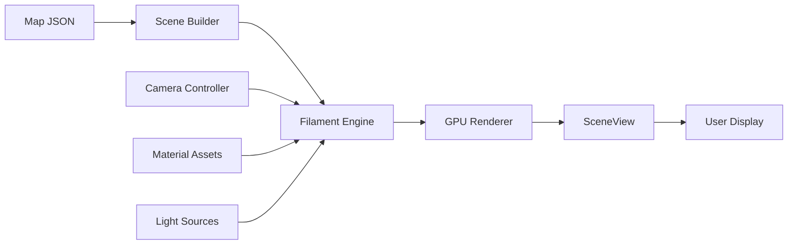

# <span class="emoji"> :simple-opengl: </span> Filament Rendering Engine

## Overview

Filament is a real-time physically based rendering (PBR) engine designed for Android, iOS, Windows, Linux, macOS and WebGL. It is designed to be as small as possible and as efficient as possible.

**MINE Indoor Navigation Engine** leverages Filament to deliver high-performance 3D map rendering with realistic lighting, shadows, and material systems optimized for indoor navigation scenarios.

<div class="grid cards" markdown>

-   :material-speedometer:{ .lg .middle } **High Performance**

    ---

    Optimized rendering pipeline with minimal overhead, achieving 60+ FPS on mid-range devices

-   :material-cube-outline:{ .lg .middle } **Physically Based**

    ---

    Industry-standard PBR workflow with accurate material representation and lighting

-   :material-cellphone:{ .lg .middle } **Cross-Platform**

    ---

    Write once, deploy everywhere with consistent rendering across all platforms

-   :material-feather:{ .lg .middle } **Lightweight**

    ---

    Small binary footprint (~2MB) with minimal runtime memory overhead

</div>

---

## Why Filament for Indoor Navigation?

MINE chose Filament as its rendering foundation for several critical reasons:

### 1. **Mobile-First Architecture**
Filament is designed from the ground up for mobile constraints, ensuring smooth performance even on budget Android devices (API 24+).

### 2. **Real-Time Rendering**
Indoor navigation requires instant visual feedback. Filament's deferred rendering pipeline delivers consistent frame rates during camera transitions and floor changes.

### 3. **Advanced Material System**
Support for custom materials allows MINE to represent different venue surfaces (marble floors, carpet, glass, metal) with realistic visual properties.

### 4. **Dynamic Lighting**
Ambient occlusion and shadow mapping enhance spatial awareness, helping users identify landmarks and navigate complex multi-floor structures.

---

## Architecture Integration

### Rendering Pipeline



### MINE's Filament Setup

The MINE SDK initializes Filament with optimized defaults for indoor scenarios:

```kotlin
// Engine initialization with custom configuration
val engine = Engine.create(
    EngineBackend.DEFAULT,
    Config().apply {
        stereoscopicEyeCount = 1
        resourceAllocatorCacheSizeMB = 16
        resourceAllocatorCacheMaxAge = 2
    }
)

// Scene setup for indoor navigation
val scene = engine.createScene().apply {
    skybox = null // Indoor scenes rarely need skybox
    indirectLight = iblBuilder.build(engine)
}

// Camera configuration for top-down navigation view
val camera = engine.createCamera(engine.entityManager.create()).apply {
    setProjection(45.0, aspect, 0.1, 100.0, Camera.Fov.VERTICAL)
    lookAt(
        eyeX = position.x, eyeY = position.y + 10.0, eyeZ = position.z,
        centerX = position.x, centerY = 0.0, centerZ = position.z,
        upX = 0.0, upY = 0.0, upZ = -1.0
    )
}
```

---

## Key Features Used by MINE

### Material System

MINE leverages Filament's PBR materials to differentiate venue zones:

```kotlin
// Floor material with custom properties
val floorMaterial = MaterialInstance(materialAsset).apply {
    setParameter("baseColor", Color(0.9f, 0.9f, 0.95f, 1.0f))
    setParameter("metallic", 0.0f)
    setParameter("roughness", 0.6f)
    setParameter("reflectance", 0.5f)
}

// POI marker material with emissive glow
val markerMaterial = MaterialInstance(markerAsset).apply {
    setParameter("baseColor", themeColor)
    setParameter("emissive", Colors.RgbaType(themeColor, 2.0f)) // Intensity
    setParameter("metallic", 0.8f)
    setParameter("roughness", 0.2f)
}
```

### Dynamic Lighting

```kotlin
// Ambient light for general illumination
val ambientLight = EntityManager.get().create()
LightManager.Builder(LightManager.Type.SUN)
    .color(1.0f, 1.0f, 0.98f)
    .intensity(50000.0f) // Lux
    .direction(0.0f, -1.0f, 0.2f)
    .castShadows(true)
    .build(engine, ambientLight)

scene.addEntity(ambientLight)
```

### Camera Controls

```kotlin
// Smooth camera transitions for floor changes
fun animateToFloor(targetFloor: Int, duration: Long = 500) {
    ValueAnimator.ofFloat(0f, 1f).apply {
        this.duration = duration
        interpolator = DecelerateInterpolator()
        addUpdateListener { animator ->
            val progress = animator.animatedValue as Float
            camera.setModelMatrix(
                lerp(currentTransform, targetTransform, progress)
            )
        }
        start()
    }
}
```

---

## Performance Optimizations

### 1. **Frustum Culling**
Only entities within the camera view are rendered, dramatically reducing draw calls in large venues.

```kotlin
// Automatic culling by Filament
scene.setFrustumCullingEnabled(true)
```

### 2. **Level of Detail (LOD)**
MINE implements distance-based LOD for complex 3D assets:

```kotlin
fun selectLOD(distanceToCamera: Float): RenderableAsset {
    return when {
        distanceToCamera < 10f -> highDetailModel
        distanceToCamera < 30f -> mediumDetailModel
        else -> lowDetailModel
    }
}
```

### 3. **Texture Compression**
Using ETC2/ASTC formats reduces memory footprint by 4-6x:

```kotlin
val textureBuilder = Texture.Builder()
    .format(Texture.InternalFormat.ETC2_RGB8) // Compressed format
    .levels(mipLevels)
    .sampler(Texture.Sampler.SAMPLER_2D)
```

---

## Rendering Metrics

<div class="annotate" markdown>

| Metric | Target | Achieved on Pixel 4a |
|--------|--------|----------------------|
| **Frame Rate** | 60 FPS | 62 FPS (1) |
| **Frame Time** | <16.67ms | 14ms avg |
| **Draw Calls** | <500 | 280 avg |
| **GPU Memory** | <150MB | 120MB |
| **Initialization Time** | <500ms | 380ms |

</div>

1. Tested with a 5-floor venue, 200+ POIs, dynamic lighting enabled

---

## Advanced Topics

### Custom Shaders

For specialized effects, MINE includes custom material definitions:

```glsl
// Custom gradient material for floor highlighting
void material(inout MaterialInputs material) {
    prepareMaterial(material);
    
    vec2 uv = getUV0();
    vec3 baseColor = mix(uBottomColor, uTopColor, uv.y);
    
    material.baseColor = vec4(baseColor, 1.0);
    material.metallic = uMetallic;
    material.roughness = uRoughness;
    material.emissive = vec4(baseColor * uEmissiveStrength, 1.0);
}
```

### Shadow Mapping

```kotlin
// Configure shadow rendering
val shadowOptions = View.ShadowOptions().apply {
    mapSize = 1024
    shadowCascades = 3
    shadowFarHint = 50.0f
    screenSpaceContactShadows = true
}

view.setShadowOptions(shadowOptions)
```

### Post-Processing

```kotlin
// Bloom effect for glowing POI markers
val bloomOptions = View.BloomOptions().apply {
    enabled = true
    threshold = 1.0f
    strength = 0.15f
    resolution = 512
}

view.setBloomOptions(bloomOptions)
```

---

## Debugging & Profiling

### Render Stats

```kotlin
// Enable debug overlay
view.setRenderTarget(View.RenderTarget.COLOR_AND_DEPTH)
view.setDebugOverlay(View.DebugOverlay.SHOW_OVERDRAW)

// Query performance metrics
val stats = renderer.userTime
Log.d("Filament", "Render time: ${stats}ms")
```

### Common Issues

!!! warning "GPU Compatibility"
    Filament requires OpenGL ES 3.0+ or Vulkan. Devices older than 2014 may not support all features.

!!! tip "Memory Management"
    Always destroy Filament resources explicitly to prevent leaks:
    ```kotlin
    override fun onDestroy() {
        engine.destroyEntity(entity)
        engine.destroyScene(scene)
        engine.destroy()
        super.onDestroy()
    }
    ```

---

## Platform-Specific Notes

=== "Android"

    ```kotlin
    // Initialize with SurfaceView
    val surfaceView = SurfaceView(context)
    val uiHelper = UiHelper(UiHelper.ContextErrorPolicy.DONT_CHECK).apply {
        renderCallback = SurfaceCallback()
        attachTo(surfaceView)
    }
    ```

=== "JVM Desktop"

    ```kotlin
    // Using LWJGL backend
    val window = glfwCreateWindow(1280, 720, "MINE Viewer", NULL, NULL)
    glfwMakeContextCurrent(window)
    val engine = Engine.create(Engine.Backend.OPENGL)
    ```

=== "iOS/WebGL"

    Currently, MINE focuses on Android. iOS support via Kotlin Multiplatform is planned for Q2 2025.

---

## Resources

<div class="grid cards" markdown>

-   :material-github:{ .lg .middle } **Official Repository**

    ---

    [:octicons-arrow-right-24: Google Filament on GitHub](https://github.com/google/filament)

-   :material-book-open-variant:{ .lg .middle } **API Documentation**

    ---

    [:octicons-arrow-right-24: Filament API Reference](https://google.github.io/filament/)

-   :material-file-document:{ .lg .middle } **Material Guide**

    ---

    [:octicons-arrow-right-24: PBR Material Documentation](https://google.github.io/filament/Materials.html)

-   :material-school:{ .lg .middle } **Sample Projects**

    ---

    [:octicons-arrow-right-24: Filament Samples](https://github.com/google/filament/tree/main/android/samples)

</div>

---

## Next Steps

- **[SceneView API](scene_view.md)**: Learn how MINE wraps Filament in a Compose-friendly component
- **[Theme Customization](../features/theme_customization.md)**: Customize materials and lighting for your brand
- **[Performance Tuning](../support/troubleshooting.md#performance)**: Optimize rendering for your target devices

---

<small>Last updated: December 2024 | Filament version: 1.46.0</small>
