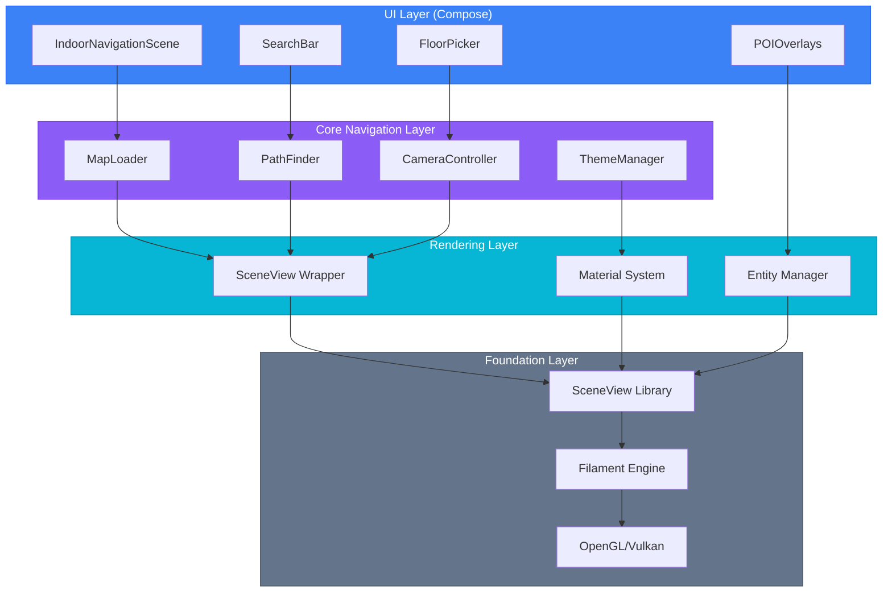
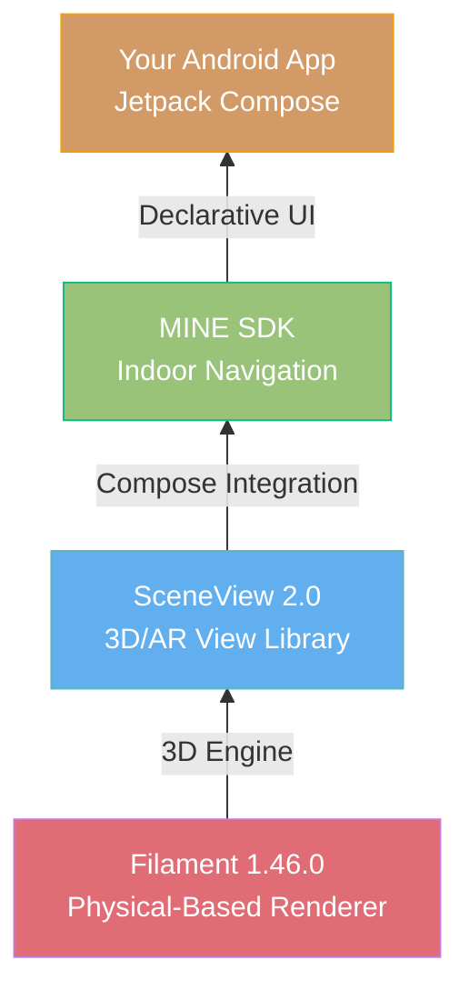
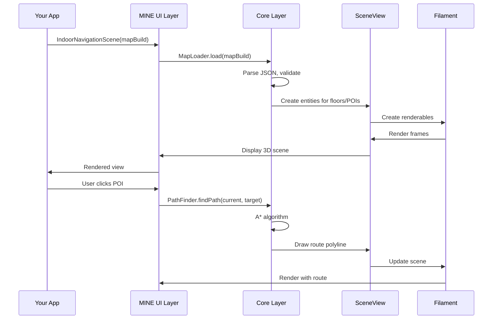

# <span class="emoji"> :octicons-package-16: </span> Module Architecture Overview

## Introduction

MINE (Machinestalk Indoor Navigation Engine) is a production-ready Android SDK built with **Jetpack Compose** that delivers high-performance indoor navigation experiences. The module architecture follows a layered approach, building upon industry-standard 3D rendering technologies to provide a declarative, customizable navigation system.

<div class="grid cards" markdown>

-   :material-layers:{ .lg .middle } **Layered Architecture**

    ---

    Clean separation between rendering, UI, and business logic for maintainability

-   :material-react:{ .lg .middle } **Compose-First**

    ---

    Built from the ground up for Jetpack Compose with declarative UI patterns

-   :material-puzzle:{ .lg .middle } **Modular Design**

    ---

    Each component is independently testable and replaceable

-   :material-tune:{ .lg .middle } **Highly Customizable**

    ---

    Theme every aspect from materials to UI components

</div>

---

## Architecture Stack

### Layered View



### Technology Stack



---

## Core Components

### 1. **Foundation Layer: Filament**

[Filament](filament.md) is Google's physically-based rendering (PBR) engine written in C++, providing:

- **High Performance**: 60+ FPS on mid-range devices
- **Mobile Optimized**: Small binary size (~2MB), low memory footprint
- **PBR Materials**: Realistic lighting and surface properties
- **Cross-Platform**: Consistent rendering across devices

```kotlin
// Filament handles low-level rendering
val engine = Engine.create()
val scene = engine.createScene()
val renderer = engine.createRenderer()
```

### 2. **Rendering Layer: SceneView**

[SceneView](https://github.com/SceneView/sceneview-android) is an open-source 3D/AR view library that wraps Filament, offering:

- **Compose Integration**: Native support for Jetpack Compose
- **AR Capabilities**: ARCore integration (optional)
- **Scene Management**: Simplified entity and node management
- **Camera Controls**: Built-in gestures for pan, zoom, rotate

```kotlin
// SceneView simplifies Filament usage
Scene(
    modifier = Modifier.fillMaxSize(),
    engine = engine,
    modelLoader = modelLoader,
    cameraNode = cameraNode,
    onGestureListener = gestureListener
)
```

### 3. **Core Layer: MINE Navigation**

MINE builds upon SceneView to provide indoor-specific features:

=== "Map Loading"

    ```kotlin
    data class MapBuild(
        val floors: List<Floor>,
        val pois: List<PointOfInterest>,
        val routes: List<Route>,
        val metadata: VenueMetadata
    )
    
    class MapLoader {
        suspend fun loadFromAssets(context: Context, filename: String): MapBuild
        suspend fun loadFromUrl(url: String): MapBuild
        fun loadFromJson(json: String): MapBuild
    }
    ```

=== "Path Finding"

    ```kotlin
    interface PathFinder {
        fun findPath(
            start: Position,
            end: Position,
            preferences: NavigationPreferences = Default
        ): Path
        
        fun findAccessiblePath(
            start: Position,
            end: Position
        ): Path
    }
    
    data class Path(
        val waypoints: List<Waypoint>,
        val distance: Float,
        val estimatedTime: Duration,
        val floorChanges: List<FloorTransition>
    )
    ```

=== "Camera Control"

    ```kotlin
    class CameraController(private val cameraNode: Node) {
        fun animateToFloor(floor: Int, duration: Long = 500)
        fun animateToPOI(poi: PointOfInterest, duration: Long = 800)
        fun setZoomLevel(level: Float)
        fun setBearing(degrees: Float)
        fun resetToDefault()
    }
    ```

=== "Theme System"

    ```kotlin
    sealed class MapTheme {
        object Light : MapTheme()
        object Dark : MapTheme()
        data class Custom(
            val floorMaterial: MaterialConfig,
            val wallMaterial: MaterialConfig,
            val poiColors: Map<PoiType, Color>,
            val routeColor: Color
        ) : MapTheme()
    }
    ```

### 4. **UI Layer: Compose Components**

MINE provides composable UI elements:

```kotlin
@Composable
fun IndoorNavigationScene(
    mapBuild: MapBuild,
    theme: MapTheme = MapTheme.Dark,
    cameraConfig: CameraConfig = CameraConfig.Default,
    onPOIClick: (PointOfInterest) -> Unit = {},
    onFloorChange: (Int) -> Unit = {}
) {
    // Renders the 3D map scene
}

@Composable
fun FloorPicker(
    floors: List<Floor>,
    currentFloor: Int,
    onFloorSelected: (Int) -> Unit
) {
    // Floor selection UI
}

@Composable
fun POISearchBar(
    pois: List<PointOfInterest>,
    onPOISelected: (PointOfInterest) -> Unit
) {
    // Search functionality
}
```

---

## Data Flow



---

## Module Dependencies

### Gradle Configuration

```kotlin
dependencies {
    // Core MINE SDK
    implementation("com.machinestalk:indoornavigationengine:1.0.0")
    
    // Required dependencies (automatically included)
    // - SceneView: io.github.sceneview:sceneview:2.0.0
    // - Filament: com.google.android.filament:filament-android:1.46.0
    // - Compose UI: androidx.compose.ui:ui:1.6.0
    
    // Optional: ARCore support
    implementation("com.google.ar:core:1.41.0")
}
```

### Module Structure

```
com.machinestalk.indoornavigationengine
├── components/           # UI Composables
│   ├── IndoorNavigationScene.kt
│   ├── FloorPicker.kt
│   ├── POISearchBar.kt
│   └── RouteOverlay.kt
├── models/              # Data classes
│   ├── MapBuild.kt
│   ├── Floor.kt
│   ├── PointOfInterest.kt
│   └── Route.kt
├── resources/           # Resource management
│   ├── MapLoader.kt
│   ├── MaterialManager.kt
│   └── TextureCache.kt
├── ui/                  # UI utilities
│   ├── ThemeManager.kt
│   ├── CameraController.kt
│   └── GestureHandler.kt
└── util/               # Helpers
    ├── JsonUtil.kt
    ├── MathUtil.kt
    └── Extensions.kt
```

---

## Performance Characteristics

### Memory Footprint

| Component | RAM Usage | Notes |
|-----------|-----------|-------|
| **MINE Core** | ~8MB | Base SDK without maps |
| **SceneView** | ~12MB | Includes scene graph |
| **Filament Engine** | ~15MB | Rendering engine |
| **Map Data (5 floors)** | ~25MB | Uncompressed JSON + textures |
| **GPU Memory** | ~120MB | Renderable entities |
| **Total** | ~180MB | Typical venue |

### Initialization Time

```kotlin
// Benchmark on Pixel 4a (Android 12)
measureTimeMillis {
    val mapBuild = MapLoader.loadFromAssets(context, "venue.json")
    // ~280ms
}

measureTimeMillis {
    IndoorNavigationScene(mapBuild)
    // ~380ms (first render)
}

// Total cold start: ~660ms
// Subsequent renders: <16ms (60 FPS)
```

---

## Architecture Benefits

### ✅ **Separation of Concerns**

Each layer has a clear responsibility:

- **Filament**: Low-level rendering
- **SceneView**: Scene management & Compose integration
- **MINE Core**: Indoor navigation logic
- **UI Components**: User interaction

### ✅ **Testability**

Layers can be tested independently:

```kotlin
@Test
fun `PathFinder calculates optimal route`() {
    val pathFinder = PathFinder(mockGraph)
    val path = pathFinder.findPath(start, end)
    
    assertEquals(5, path.waypoints.size)
    assertTrue(path.distance < 100f)
}
```

### ✅ **Extensibility**

Easy to extend without modifying core:

```kotlin
// Custom POI renderer
class CustomPOIRenderer : POIRenderer {
    override fun render(poi: PointOfInterest, scene: Scene) {
        // Custom rendering logic
    }
}

IndoorNavigationScene(
    mapBuild = mapBuild,
    poiRenderer = CustomPOIRenderer()
)
```

### ✅ **Performance**

Optimized at each layer:

- **Filament**: GPU-accelerated rendering
- **SceneView**: Frustum culling, LOD management
- **MINE**: Cached path calculations, entity pooling

---

## Integration Example

### Full Implementation

```kotlin
@Composable
fun VenueNavigationScreen(venueId: String) {
    // State management
    var mapBuild by remember { mutableStateOf<MapBuild?>(null) }
    var currentFloor by remember { mutableIntStateOf(0) }
    var selectedPOI by remember { mutableStateOf<PointOfInterest?>(null) }
    
    // Load map on composition
    LaunchedEffect(venueId) {
        mapBuild = MapLoader.loadFromAssets(
            context = context,
            filename = "venues/$venueId.json"
        )
    }
    
    mapBuild?.let { map ->
        Box(modifier = Modifier.fillMaxSize()) {
            // Main 3D scene
            IndoorNavigationScene(
                mapBuild = map,
                theme = MapTheme.Dark,
                cameraConfig = CameraConfig(
                    initialFloor = currentFloor,
                    zoomLevel = 15f
                ),
                onPOIClick = { poi -> selectedPOI = poi },
                onFloorChange = { floor -> currentFloor = floor }
            )
            
            // Overlay: Floor picker
            FloorPicker(
                floors = map.floors,
                currentFloor = currentFloor,
                onFloorSelected = { floor -> currentFloor = floor },
                modifier = Modifier
                    .align(Alignment.CenterEnd)
                    .padding(16.dp)
            )
            
            // Overlay: Search bar
            POISearchBar(
                pois = map.pois.filter { it.floor == currentFloor },
                onPOISelected = { poi -> selectedPOI = poi },
                modifier = Modifier
                    .align(Alignment.TopCenter)
                    .padding(16.dp)
            )
            
            // Overlay: POI details
            selectedPOI?.let { poi ->
                POIDetailCard(
                    poi = poi,
                    onNavigate = { /* Start navigation */ },
                    onDismiss = { selectedPOI = null },
                    modifier = Modifier
                        .align(Alignment.BottomCenter)
                        .padding(16.dp)
                )
            }
        }
    }
}
```

---

## Comparison with Alternatives

| Feature | MINE | Google Maps Indoor | Mapbox | Custom Solution |
|---------|------|-------------------|--------|-----------------|
| **3D Rendering** | ✅ Filament PBR | ❌ 2D tiles | ⚠️ Limited 3D | 🔧 DIY |
| **Offline Support** | ✅ Full | ⚠️ Cached only | ⚠️ Cached only | 🔧 DIY |
| **Compose Native** | ✅ Yes | ❌ Views only | ❌ Views only | 🔧 DIY |
| **Path Finding** | ✅ Built-in | ⚠️ Limited | ⚠️ API-based | 🔧 DIY |
| **Customization** | ✅ Full control | ❌ Limited | ⚠️ Style only | ✅ Full |
| **Setup Time** | ⏱️ <15 min | ⏱️ Hours | ⏱️ Hours | ⏱️ Weeks |
| **Cost** | 💰 One-time | 💰💰 Per-use | 💰💰 Per-use | 💰💰💰 Dev time |

---

## Advanced Topics

### Custom Material System

```kotlin
// Extend ThemeManager for venue-specific materials
class VenueMaterialManager(engine: Engine) {
    private val carpetMaterial = loadMaterial("carpet.filamat")
    private val marbleMaterial = loadMaterial("marble.filamat")
    
    fun applyToZone(zone: Zone): MaterialInstance {
        return when (zone.type) {
            ZoneType.HALLWAY -> carpetMaterial
            ZoneType.LOBBY -> marbleMaterial
            else -> defaultMaterial
        }
    }
}
```

### State Management Integration

```kotlin
// With ViewModel
class NavigationViewModel : ViewModel() {
    private val _mapState = MutableStateFlow<MapState>(MapState.Loading)
    val mapState = _mapState.asStateFlow()
    
    fun loadMap(venueId: String) {
        viewModelScope.launch {
            _mapState.value = MapState.Loading
            val map = mapRepository.fetchMap(venueId)
            _mapState.value = MapState.Success(map)
        }
    }
}

@Composable
fun NavigationScreen(viewModel: NavigationViewModel) {
    val mapState by viewModel.mapState.collectAsState()
    
    when (val state = mapState) {
        is MapState.Loading -> LoadingIndicator()
        is MapState.Success -> IndoorNavigationScene(state.mapBuild)
        is MapState.Error -> ErrorView(state.message)
    }
}
```

---

## Resources

<div class="grid cards" markdown>

-   :material-cube-outline:{ .lg .middle } **Filament Details**

    ---

    Deep dive into the rendering engine

    [:octicons-arrow-right-24: Filament Reference](filament.md)

-   :material-eye:{ .lg .middle } **SceneView API**

    ---

    Learn about the 3D scene wrapper

    [:octicons-arrow-right-24: SceneView Documentation](scene_view.md)

-   :material-palette:{ .lg .middle } **Theme System**

    ---

    Customize materials and colors

    [:octicons-arrow-right-24: Theme Customization](../features/theme_customization.md)

-   :material-code-braces:{ .lg .middle } **Component Reference**

    ---

    Full API documentation

    [:octicons-arrow-right-24: API Reference](https://indoor-navigation-lib.bitbucket.io/)

</div>

---

## FAQ

??? question "Can I use MINE with existing View-based UI?"

    Yes, while MINE is Compose-first, you can wrap composables in ComposeView:
    
    ```kotlin
    val composeView = ComposeView(context).apply {
        setContent {
            IndoorNavigationScene(mapBuild)
        }
    }
    viewGroup.addView(composeView)
    ```

??? question "Does MINE support AR features?"

    MINE focuses on indoor navigation. For AR, you can integrate ARCore separately and use SceneView's AR capabilities alongside MINE's navigation logic.

??? question "What's the minimum Android version?"

    Android 7.0 (API 24) for basic functionality. Some features like Vulkan backend require API 28+.

??? question "How do I update maps without app releases?"

    Use `MapLoader.loadFromUrl()` to fetch maps from your CDN:
    
    ```kotlin
    val mapBuild = MapLoader.loadFromUrl(
        "https://cdn.example.com/venues/${venueId}.json"
    )
    ```

---

## Next Steps

1. **[Quick Start Guide](../getting_started/quick_start.md)** - Get MINE running in 15 minutes
2. **[SceneView API Reference](scene_view.md)** - Understand the 3D scene component
3. **[Map Loading](../features/map_loading.md)** - Learn about map data formats
4. **[UI Components](../features/ui_components.md)** - Explore composable widgets

---

<small>Last updated: December 2024 | MINE SDK v1.0.0 | SceneView 2.0 | Filament 1.46.0</small>

