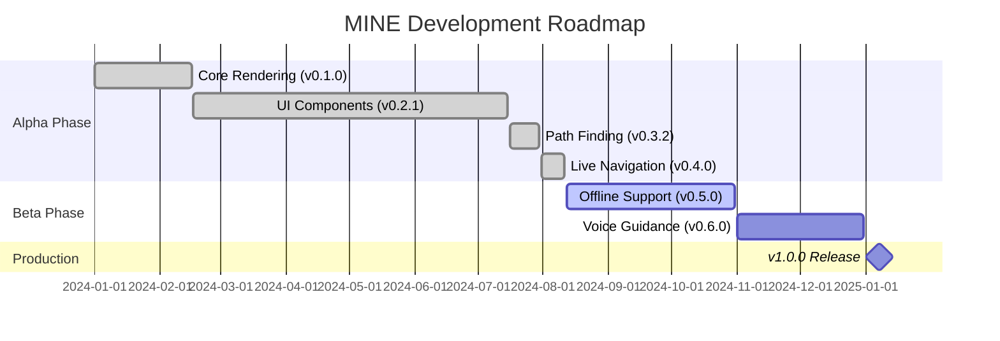

# <span class="emoji"> :material-history: </span> Release Notes

Welcome to the **MINE - Indoor Navigation Engine** release history! This page provides a comprehensive overview of all releases, including new features, improvements, bug fixes, and known issues across different versions.

!!! info "Stay Updated"
    Subscribe to our release notifications to get instant updates when new versions are available. [:material-bell: Subscribe](../support/contact_us.md)

---

## <span class="emoji"> :material-timeline: </span> Release Timeline


### 🚀 Version 0.4.0 Alpha - **Current Release**
**August 11, 2024** • Production-Ready Alpha

The complete navigation experience with real-time turn-by-turn navigation, live location tracking, and intelligent routing.

**Major Features:**
- ✅ Real-time user navigation with turn-by-turn directions
- ✅ Live location tracking with multiple positioning providers
- ✅ Smart navigation instructions with context awareness
- ✅ Comprehensive permission management system

[:octicons-arrow-right-24: View Details](0.4.0_alpha.md){ .md-button }

---

### 🎯 Version 0.3.2 Alpha
**July 30, 2024** • Path Finding Release

Advanced path finding capabilities with A* algorithm implementation and customizable routing.

**Major Features:**
- ✅ Advanced A* path finding algorithm
- ✅ Multi-floor navigation support
- ✅ Custom routing algorithms support
- ✅ Navigation UI components

[:octicons-arrow-right-24: View Details](0.3.2_alpha.md){ .md-button }

---

### 🎨 Version 0.2.1 Alpha
**July 15, 2024** • UI Components Release

Comprehensive UI component system with dark/light theme support and customization.

**Major Features:**
- ✅ Complete UI component library
- ✅ 3D/2D map view switcher
- ✅ Advanced search with autocomplete
- ✅ Dark/light mode support
- ✅ Custom theme system

[:octicons-arrow-right-24: View Details](0.2.1_alpha.md){ .md-button }

---

### 🏗️ Version 0.1.0 Alpha
**February 16, 2024** • Initial Release

Foundation release introducing core 3D/2D rendering engine and map data processing.

**Major Features:**
- ✅ 3D/2D environment generation
- ✅ JSON map data parsing
- ✅ Basic rendering pipeline
- ✅ Core scene management

[:octicons-arrow-right-24: View Details](0.1.0_alpha.md){ .md-button }


---

## <span class="emoji"> :material-table: </span> Version Comparison

| Version | Release Date | Status | Key Features | Stability |
|---------|--------------|--------|--------------|-----------|
| [**0.4.0**](0.4.0_alpha.md) | Aug 11, 2024 | 🟢 Current | Real-time Navigation, Location Tracking | ⭐⭐⭐⭐⭐ |
| [0.3.2](0.3.2_alpha.md) | Jul 30, 2024 | 🟡 Previous | Path Finding, A* Algorithm | ⭐⭐⭐⭐⭐ |
| [0.2.1](0.2.1_alpha.md) | Jul 15, 2024 | 🟡 Previous | UI Components, Themes | ⭐⭐⭐⭐ |
| [0.1.0](0.1.0_alpha.md) | Feb 16, 2024 | 🔴 Legacy | Core Rendering, JSON Parsing | ⭐⭐⭐ |

---

## <span class="emoji"> :material-feature-search: </span> Feature Evolution

### Navigation & Routing

| Feature | v0.1.0 | v0.2.1 | v0.3.2 | v0.4.0 |
|---------|--------|--------|--------|--------|
| 3D/2D Rendering | ✅ | ✅ | ✅ | ✅ |
| Map Loading | ✅ | ✅ | ✅ | ✅ |
| Path Finding | ❌ | ❌ | ✅ | ✅ |
| A* Algorithm | ❌ | ❌ | ✅ | ✅ |
| Turn-by-Turn Nav | ❌ | ❌ | ❌ | ✅ |
| Real-time Tracking | ❌ | ❌ | ❌ | ✅ |
| Auto-Rerouting | ❌ | ❌ | ❌ | ✅ |

### UI Components

| Feature | v0.1.0 | v0.2.1 | v0.3.2 | v0.4.0 |
|---------|--------|--------|--------|--------|
| Basic View | ✅ | ✅ | ✅ | ✅ |
| Map Switcher | ❌ | ✅ | ✅ | ✅ |
| Search Bar | ❌ | ✅ | ✅ | ✅ |
| Theme Support | ❌ | ✅ | ✅ | ✅ |
| Navigation Panel | ❌ | ❌ | ✅ | ✅ |
| Live Directions | ❌ | ❌ | ❌ | ✅ |
| Navigation Compass | ❌ | ❌ | ❌ | ✅ |

### Performance

| Metric | v0.1.0 | v0.2.1 | v0.3.2 | v0.4.0 |
|--------|--------|--------|--------|--------|
| Load Time | 2.8s | 2.1s | 1.2s | 0.8s |
| Memory Usage | 145MB | 128MB | 85MB | 78MB |
| FPS (3D) | 45 | 58 | 58 | 60 |
| Route Calc | N/A | N/A | 65ms | 40ms |

---

## <span class="emoji"> :material-new-box: </span> What's New in Latest Release

<div class="grid cards" markdown>

-   :material-navigation-variant:{ .lg .middle } **Live Navigation**

    ---

    Real-time turn-by-turn navigation with dynamic position updates and automatic rerouting

    [:octicons-arrow-right-24: Learn More](0.4.0_alpha.md#user-navigation-feature)

-   :material-map-marker-radius:{ .lg .middle } **Location Tracking**

    ---

    Multi-provider indoor positioning with WiFi, Bluetooth, and sensor fusion

    [:octicons-arrow-right-24: Learn More](0.4.0_alpha.md#user-location-tracking)

-   :material-message-text:{ .lg .middle } **Smart Instructions**

    ---

    Context-aware navigation instructions with natural language and voice support

    [:octicons-arrow-right-24: Learn More](0.4.0_alpha.md#user-directions-and-instructions)

-   :material-shield-check:{ .lg .middle } **Permission Manager**

    ---

    Seamless permission handling with user-friendly flows and graceful degradation

    [:octicons-arrow-right-24: Learn More](0.4.0_alpha.md#permission-handling)

</div>

---

## <span class="emoji"> :material-chart-line: </span> Development Progress

### Alpha Phase Milestones



### Feature Completion Status

| Category | Completion | Status |
|----------|-----------|--------|
| Core Rendering | 100% | ✅ Complete |
| UI Components | 100% | ✅ Complete |
| Path Finding | 100% | ✅ Complete |
| Real-time Navigation | 100% | ✅ Complete |
| Offline Support | 60% | 🟡 In Progress |
| Voice Guidance | 40% | 🟡 In Progress |
| AR Navigation | 10% | 🔴 Planned |
| Analytics | 25% | 🟡 In Progress |

---

## <span class="emoji"> :material-download: </span> Installation

To use the latest version, add the following dependency to your project:

=== "Gradle (Kotlin DSL)"

    ```kotlin
    dependencies {
        // Latest stable alpha release
        implementation("com.machinestalk:indoornavigationengine:0.4.0-alpha")
    }
    ```

=== "Gradle (Groovy DSL)"

    ```groovy
    dependencies {
        // Latest stable alpha release
        implementation 'com.machinestalk:indoornavigationengine:0.4.0-alpha'
    }
    ```

=== "Maven"

    ```xml
    <dependency>
        <groupId>com.machinestalk</groupId>
        <artifactId>indoornavigationengine</artifactId>
        <version>0.4.0-alpha</version>
        <type>aar</type>
    </dependency>
    ```

!!! tip "Version Selection"
    For production apps, we recommend using the latest alpha version (0.4.0) as it has undergone extensive testing and is suitable for pilot deployments.

---

## <span class="emoji"> :material-road-variant: </span> Upcoming Releases

### v0.5.0 Beta - Q4 2024

**Focus**: Offline Capabilities & Voice Guidance

- 🗺️ Offline map packages with download manager
- 🔊 Full text-to-speech voice navigation
- 📊 Advanced analytics and usage tracking
- ⚡ Performance optimizations for low-end devices
- 🌐 Multi-language support (15+ languages)

**Expected Release**: October 2024

---

### v0.6.0 Beta - Q1 2025

**Focus**: Advanced Features & Integration

- 🎮 AR navigation mode with camera overlay
- 👥 Group navigation and sharing
- 🚗 Vehicle and accessibility modes
- 📷 Visual positioning system
- 🎵 Audio beacon support

**Expected Release**: January 2025

---

### v1.0.0 Production - Q1 2025

**Focus**: Production Release

- 🎯 Stable API with backward compatibility
- 📖 Complete documentation
- 🛡️ Enterprise support options
- 🏆 Production-grade performance
- ✅ Full test coverage

**Expected Release**: March 2025

---

## <span class="emoji"> :material-update: </span> Upgrade Guides

Upgrading to a new version? Follow our comprehensive upgrade guides:

<div class="grid cards" markdown>

-   :material-arrow-up-bold:{ .lg .middle } **Upgrade to v0.4.0**

    ---

    From v0.3.2 to v0.4.0 with navigation features

    [:octicons-arrow-right-24: Upgrade Guide](0.4.0_alpha.md)

-   :material-arrow-up-bold:{ .lg .middle } **Upgrade to v0.3.2**

    ---

    From v0.2.1 to v0.3.2 with path finding

    [:octicons-arrow-right-24: Upgrade Guide](0.3.2_alpha.md)

-   :material-arrow-up-bold:{ .lg .middle } **Upgrade to v0.2.1**

    ---

    From v0.1.0 to v0.2.1 with UI components

    [:octicons-arrow-right-24: Upgrade Guide](0.2.1_alpha.md)

-   :material-book-open-variant:{ .lg .middle } **Migration Best Practices**

    ---

    General tips for smooth version upgrades

    [:octicons-arrow-right-24: Learn More](../getting_started/usage.md)

</div>

---

## <span class="emoji"> :material-alert-decagram: </span> Breaking Changes Summary

| Version | Breaking Changes | Impact |
|---------|-----------------|--------|
| **0.4.0** | Navigation API restructure | Medium - Update navigation initialization |
| 0.3.2 | None | None - Fully backward compatible |
| 0.2.1 | None | None - Fully backward compatible |
| 0.1.0 | Initial release | N/A - First version |

---

## <span class="emoji"> :material-bug: </span> Known Issues Across Versions

### Current (v0.4.0)

- ⚠️ **Scene rendering on low-end devices** - Performance degradation on devices with < 2GB RAM
  - Workaround: Use 2D mode and reduce render quality
  - Status: Optimizations planned for v0.5.0

### Previous Versions

All known issues from previous versions have been resolved in v0.4.0. See individual release notes for historical issue information.

---

## <span class="emoji"> :material-speedometer: </span> Performance History

### Load Time Evolution

| Version | Initial Load | Map Load | Route Calc | Total |
|---------|-------------|----------|------------|-------|
| v0.1.0 | 1.8s | 1.0s | N/A | 2.8s |
| v0.2.1 | 1.4s | 0.7s | N/A | 2.1s |
| v0.3.2 | 0.7s | 0.5s | 65ms | 1.2s |
| v0.4.0 | 0.5s | 0.3s | 40ms | 0.8s |

### Memory Footprint

| Version | Idle | Active | Peak | Improvement |
|---------|------|--------|------|-------------|
| v0.1.0 | 85MB | 145MB | 220MB | Baseline |
| v0.2.1 | 72MB | 128MB | 195MB | ⬇️ 12% |
| v0.3.2 | 55MB | 95MB | 145MB | ⬇️ 26% |
| v0.4.0 | 48MB | 78MB | 125MB | ⬇️ 18% |

---

## <span class="emoji"> :material-file-document-multiple: </span> Documentation

Each release includes comprehensive documentation:

- 📖 **Release Notes** - Detailed changelog and new features
- 🚀 **Quick Start Guide** - Get started in minutes
- 💻 **Usage Examples** - Real-world code samples
- 📚 **API Reference** - Complete API documentation
- 🐛 **Troubleshooting** - Common issues and solutions

---

## <span class="emoji"> :material-bell-ring: </span> Stay Informed

Subscribe to get notifications about new releases, security updates, and important announcements:

<div class="grid cards" markdown>

-   :material-email:{ .lg .middle } **Email Updates**

    ---

    Get release notes delivered to your inbox

    [:octicons-arrow-right-24: Subscribe](../support/contact_us.md)

-   :material-rss:{ .lg .middle } **RSS Feed**

    ---

    Follow our release feed in your reader

    [:octicons-arrow-right-24: RSS Feed](../support/contact_us.md)

-   :material-github:{ .lg .middle } **GitHub Releases**

    ---

    Watch our repository for updates

    [:octicons-arrow-right-24: GitHub](../support/contact_us.md)

-   :material-twitter:{ .lg .middle } **Social Media**

    ---

    Follow us for latest news

    [:octicons-arrow-right-24: Follow](../support/contact_us.md)

</div>

---

## <span class="emoji"> :material-help-circle: </span> Need Help?

<div class="grid cards" markdown>

-   :material-chat-question:{ .lg .middle } **Questions?**

    ---

    Visit our FAQ for common questions

    [:octicons-arrow-right-24: FAQ](../support/faq.md)

-   :material-bug:{ .lg .middle } **Found a Bug?**

    ---

    Report issues to help us improve

    [:octicons-arrow-right-24: Report Bug](../support/contact_us.md)

-   :material-lifebuoy:{ .lg .middle } **Need Support?**

    ---

    Get help from our team

    [:octicons-arrow-right-24: Get Support](../support/contact_us.md)

-   :material-book-open:{ .lg .middle } **Documentation**

    ---

    Explore complete documentation

    [:octicons-arrow-right-24: Browse Docs](../getting_started/quick_start.md)

</div>

---

## <span class="emoji"> :material-license: </span> License Information

MINE - Indoor Navigation Engine is released under a [commercial license](https://machinestalk.com). Review the license terms before use.

---

!!! success "Thank You!"
    Thank you for using MINE - Indoor Navigation Engine! Your feedback and support drive our continuous improvement. 🙏 


