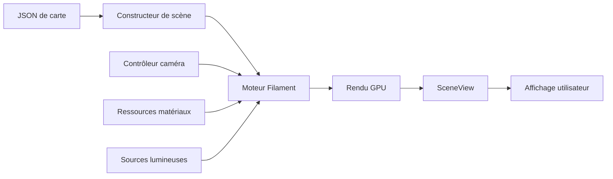

# <span class="emoji"> :simple-opengl: </span> Moteur de rendu Filament

## Vue d'ensemble

Filament est un moteur de rendu en temps réel basé sur la physique (PBR) conçu pour Android, iOS, Windows, Linux, macOS et WebGL. Il est conçu pour être aussi compact et efficace que possible.

**Le Moteur de Navigation Intérieure MINE** exploite Filament pour offrir un rendu de cartes 3D haute performance avec un éclairage réaliste, des ombres et des systèmes de matériaux optimisés pour les scénarios de navigation intérieure.

<div class="grid cards" markdown>

-   :material-speedometer:{ .lg .middle } **Haute performance**

    ---

    Pipeline de rendu optimisé avec une surcharge minimale, atteignant plus de 60 FPS sur les appareils de milieu de gamme

-   :material-cube-outline:{ .lg .middle } **Basé sur la physique**

    ---

    Flux de travail PBR conforme aux standards de l'industrie avec représentation précise des matériaux et de l'éclairage

-   :material-cellphone:{ .lg .middle } **Multi-plateforme**

    ---

    Écrivez une fois, déployez partout avec un rendu cohérent sur toutes les plateformes

-   :material-feather:{ .lg .middle } **Léger**

    ---

    Empreinte binaire réduite (~2MB) avec une surcharge mémoire minimale à l'exécution

</div>

---

## Pourquoi Filament pour la navigation intérieure ?

MINE a choisi Filament comme fondation de rendu pour plusieurs raisons critiques :

### 1. **Architecture mobile d'abord**
Filament est conçu dès le départ pour les contraintes mobiles, garantissant des performances fluides même sur les appareils Android économiques (API 24+).

### 2. **Rendu en temps réel**
La navigation intérieure nécessite un retour visuel instantané. Le pipeline de rendu différé de Filament offre des fréquences d'images constantes lors des transitions de caméra et des changements d'étage.

### 3. **Système de matériaux avancé**
La prise en charge des matériaux personnalisés permet à MINE de représenter différentes surfaces de lieux (sols en marbre, moquette, verre, métal) avec des propriétés visuelles réalistes.

### 4. **Éclairage dynamique**
L'occlusion ambiante et le mappage d'ombres améliorent la conscience spatiale, aidant les utilisateurs à identifier les points de repère et à naviguer dans des structures multi-étages complexes.

---

## Intégration de l'architecture

### Pipeline de rendu



### Configuration Filament de MINE

Le SDK MINE initialise Filament avec des paramètres optimisés par défaut pour les scénarios intérieurs :

```kotlin
// Initialisation du moteur avec configuration personnalisée
val engine = Engine.create(
    EngineBackend.DEFAULT,
    Config().apply {
        stereoscopicEyeCount = 1
        resourceAllocatorCacheSizeMB = 16
        resourceAllocatorCacheMaxAge = 2
    }
)

// Configuration de scène pour la navigation intérieure
val scene = engine.createScene().apply {
    skybox = null // Les scènes intérieures nécessitent rarement un skybox
    indirectLight = iblBuilder.build(engine)
}

// Configuration caméra pour vue de navigation en plongée
val camera = engine.createCamera(engine.entityManager.create()).apply {
    setProjection(45.0, aspect, 0.1, 100.0, Camera.Fov.VERTICAL)
    lookAt(
        eyeX = position.x, eyeY = position.y + 10.0, eyeZ = position.z,
        centerX = position.x, centerY = 0.0, centerZ = position.z,
        upX = 0.0, upY = 0.0, upZ = -1.0
    )
}
```

---

## Fonctionnalités clés utilisées par MINE

### Système de matériaux

MINE exploite les matériaux PBR de Filament pour différencier les zones de lieu :

```kotlin
// Matériau de sol avec propriétés personnalisées
val floorMaterial = MaterialInstance(materialAsset).apply {
    setParameter("baseColor", Color(0.9f, 0.9f, 0.95f, 1.0f))
    setParameter("metallic", 0.0f)
    setParameter("roughness", 0.6f)
    setParameter("reflectance", 0.5f)
}

// Matériau de marqueur POI avec lueur émissive
val markerMaterial = MaterialInstance(markerAsset).apply {
    setParameter("baseColor", themeColor)
    setParameter("emissive", Colors.RgbaType(themeColor, 2.0f)) // Intensité
    setParameter("metallic", 0.8f)
    setParameter("roughness", 0.2f)
}
```

### Éclairage dynamique

```kotlin
// Lumière ambiante pour l'éclairage général
val ambientLight = EntityManager.get().create()
LightManager.Builder(LightManager.Type.SUN)
    .color(1.0f, 1.0f, 0.98f)
    .intensity(50000.0f) // Lux
    .direction(0.0f, -1.0f, 0.2f)
    .castShadows(true)
    .build(engine, ambientLight)

scene.addEntity(ambientLight)
```

### Contrôles caméra

```kotlin
// Transitions caméra fluides pour les changements d'étage
fun animateToFloor(targetFloor: Int, duration: Long = 500) {
    ValueAnimator.ofFloat(0f, 1f).apply {
        this.duration = duration
        interpolator = DecelerateInterpolator()
        addUpdateListener { animator ->
            val progress = animator.animatedValue as Float
            camera.setModelMatrix(
                lerp(currentTransform, targetTransform, progress)
            )
        }
        start()
    }
}
```

---

## Optimisations de performance

### 1. **Culling de frustum**
Seules les entités dans le champ de vision de la caméra sont rendues, réduisant considérablement les appels de dessin dans les grands lieux.

```kotlin
// Culling automatique par Filament
scene.setFrustumCullingEnabled(true)
```

### 2. **Niveau de détail (LOD)**
MINE implémente un LOD basé sur la distance pour les ressources 3D complexes :

```kotlin
fun selectLOD(distanceToCamera: Float): RenderableAsset {
    return when {
        distanceToCamera < 10f -> highDetailModel
        distanceToCamera < 30f -> mediumDetailModel
        else -> lowDetailModel
    }
}
```

### 3. **Compression de texture**
L'utilisation des formats ETC2/ASTC réduit l'empreinte mémoire de 4 à 6 fois :

```kotlin
val textureBuilder = Texture.Builder()
    .format(Texture.InternalFormat.ETC2_RGB8) // Format compressé
    .levels(mipLevels)
    .sampler(Texture.Sampler.SAMPLER_2D)
```

---

## Métriques de rendu

<div class="annotate" markdown>

| Métrique | Cible | Atteint sur Pixel 4a |
|----------|-------|----------------------|
| **Fréquence d'images** | 60 FPS | 62 FPS (1) |
| **Temps de trame** | <16.67ms | 14ms moy. |
| **Appels de dessin** | <500 | 280 moy. |
| **Mémoire GPU** | <150MB | 120MB |
| **Temps d'initialisation** | <500ms | 380ms |

</div>

1. Testé avec un lieu de 5 étages, plus de 200 POI, éclairage dynamique activé

---

## Sujets avancés

### Shaders personnalisés

Pour des effets spécialisés, MINE inclut des définitions de matériaux personnalisés :

```glsl
// Matériau dégradé personnalisé pour la mise en surbrillance d'étage
void material(inout MaterialInputs material) {
    prepareMaterial(material);
    
    vec2 uv = getUV0();
    vec3 baseColor = mix(uBottomColor, uTopColor, uv.y);
    
    material.baseColor = vec4(baseColor, 1.0);
    material.metallic = uMetallic;
    material.roughness = uRoughness;
    material.emissive = vec4(baseColor * uEmissiveStrength, 1.0);
}
```

### Mappage d'ombres

```kotlin
// Configurer le rendu d'ombres
val shadowOptions = View.ShadowOptions().apply {
    mapSize = 1024
    shadowCascades = 3
    shadowFarHint = 50.0f
    screenSpaceContactShadows = true
}

view.setShadowOptions(shadowOptions)
```

### Post-traitement

```kotlin
// Effet bloom pour les marqueurs POI lumineux
val bloomOptions = View.BloomOptions().apply {
    enabled = true
    threshold = 1.0f
    strength = 0.15f
    resolution = 512
}

view.setBloomOptions(bloomOptions)
```

---

## Débogage et profilage

### Statistiques de rendu

```kotlin
// Activer la superposition de débogage
view.setRenderTarget(View.RenderTarget.COLOR_AND_DEPTH)
view.setDebugOverlay(View.DebugOverlay.SHOW_OVERDRAW)

// Interroger les métriques de performance
val stats = renderer.userTime
Log.d("Filament", "Temps de rendu : ${stats}ms")
```

### Problèmes courants

!!! warning "Compatibilité GPU"
    Filament nécessite OpenGL ES 3.0+ ou Vulkan. Les appareils antérieurs à 2014 peuvent ne pas prendre en charge toutes les fonctionnalités.

!!! tip "Gestion de la mémoire"
    Détruisez toujours explicitement les ressources Filament pour éviter les fuites :
    ```kotlin
    override fun onDestroy() {
        engine.destroyEntity(entity)
        engine.destroyScene(scene)
        engine.destroy()
        super.onDestroy()
    }
    ```

---

## Notes spécifiques à la plateforme

=== "Android"

    ```kotlin
    // Initialiser avec SurfaceView
    val surfaceView = SurfaceView(context)
    val uiHelper = UiHelper(UiHelper.ContextErrorPolicy.DONT_CHECK).apply {
        renderCallback = SurfaceCallback()
        attachTo(surfaceView)
    }
    ```

=== "JVM Desktop"

    ```kotlin
    // Utilisation du backend LWJGL
    val window = glfwCreateWindow(1280, 720, "MINE Viewer", NULL, NULL)
    glfwMakeContextCurrent(window)
    val engine = Engine.create(Engine.Backend.OPENGL)
    ```

=== "iOS/WebGL"

    Actuellement, MINE se concentre sur Android. Le support iOS via Kotlin Multiplatform est prévu pour T2 2025.

---

## Ressources

<div class="grid cards" markdown>

-   :material-github:{ .lg .middle } **Dépôt officiel**

    ---

    [:octicons-arrow-right-24: Google Filament sur GitHub](https://github.com/google/filament)

-   :material-book-open-variant:{ .lg .middle } **Documentation API**

    ---

    [:octicons-arrow-right-24: Référence API Filament](https://google.github.io/filament/)

-   :material-file-document:{ .lg .middle } **Guide des matériaux**

    ---

    [:octicons-arrow-right-24: Documentation matériaux PBR](https://google.github.io/filament/Materials.html)

-   :material-school:{ .lg .middle } **Projets d'exemple**

    ---

    [:octicons-arrow-right-24: Exemples Filament](https://github.com/google/filament/tree/main/android/samples)

</div>

---

## Prochaines étapes

- **[API SceneView](scene_view.md)** : Découvrez comment MINE encapsule Filament dans un composant compatible Compose
- **[Personnalisation du thème](../features/theme_customization.md)** : Personnalisez les matériaux et l'éclairage pour votre marque
- **[Réglage des performances](../support/troubleshooting.md#performance)** : Optimisez le rendu pour vos appareils cibles

---

<small>Dernière mise à jour : Décembre 2024 | Version Filament : 1.46.0</small>
