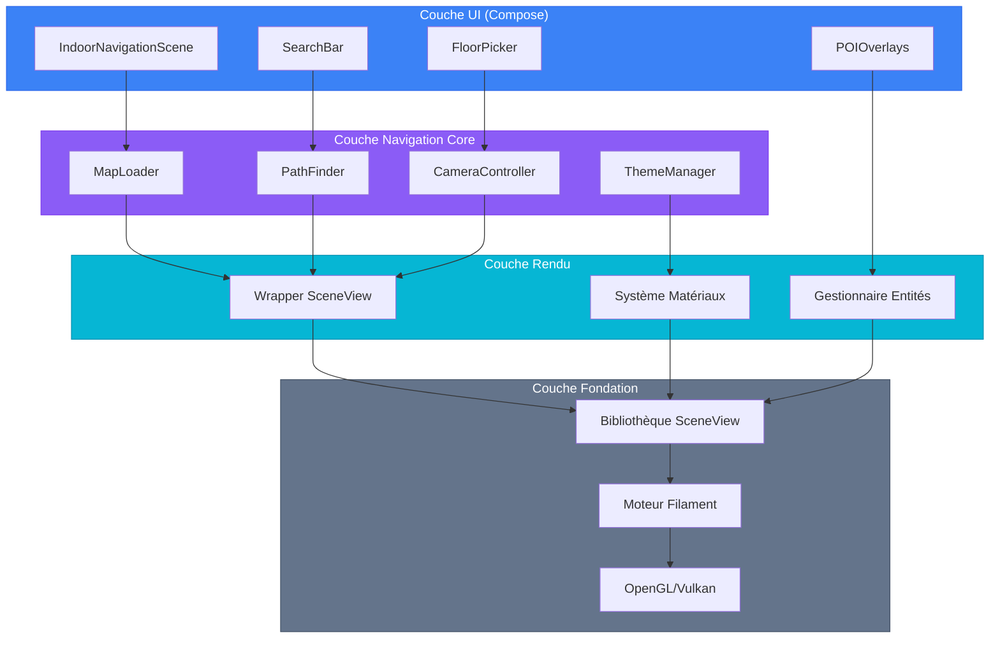
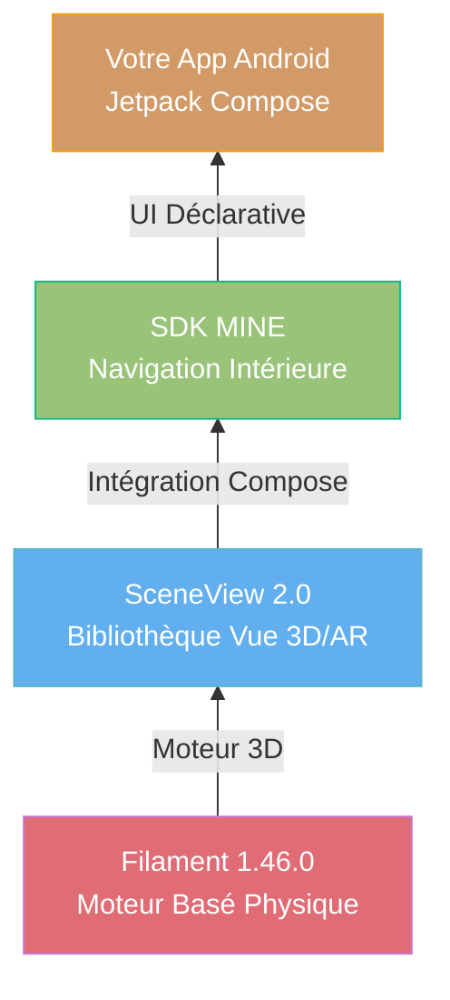
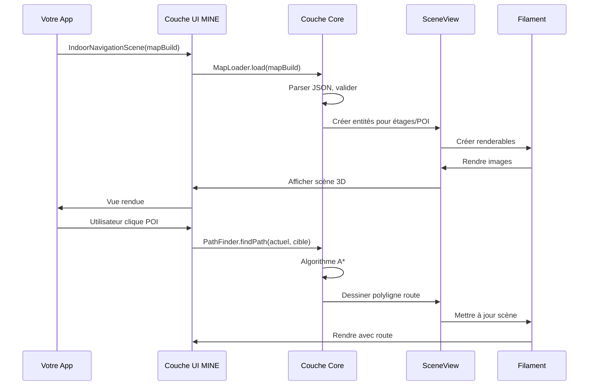

# <span class="emoji"> :octicons-package-16: </span> Aperçu de l'architecture du module

## Introduction

MINE (Machinestalk Indoor Navigation Engine) est un SDK Android prêt pour la production, construit avec **Jetpack Compose**, qui offre des expériences de navigation intérieure haute performance. L'architecture modulaire suit une approche en couches, s'appuyant sur des technologies de rendu 3D standards de l'industrie pour fournir un système de navigation déclaratif et personnalisable.

<div class="grid cards" markdown>

-   :material-layers:{ .lg .middle } **Architecture en couches**

    ---

    Séparation claire entre rendu, UI et logique métier pour la maintenabilité

-   :material-react:{ .lg .middle } **Compose d'abord**

    ---

    Construit dès le départ pour Jetpack Compose avec des modèles d'UI déclaratifs

-   :material-puzzle:{ .lg .middle } **Conception modulaire**

    ---

    Chaque composant est testable et remplaçable indépendamment

-   :material-tune:{ .lg .middle } **Hautement personnalisable**

    ---

    Personnalisez chaque aspect, des matériaux aux composants UI

</div>

---

## Pile d'architecture

### Vue en couches



### Pile technologique



---

## Composants principaux

### 1. **Couche fondation : Filament**

[Filament](filament.md) est le moteur de rendu basé sur la physique (PBR) de Google écrit en C++, offrant :

- **Haute performance** : Plus de 60 FPS sur les appareils de milieu de gamme
- **Optimisé mobile** : Taille binaire réduite (~2MB), faible empreinte mémoire
- **Matériaux PBR** : Éclairage réaliste et propriétés de surface
- **Multi-plateforme** : Rendu cohérent sur tous les appareils

```kotlin
// Filament gère le rendu bas niveau
val engine = Engine.create()
val scene = engine.createScene()
val renderer = engine.createRenderer()
```

### 2. **Couche rendu : SceneView**

[SceneView](https://github.com/SceneView/sceneview-android) est une bibliothèque de vue 3D/AR open source qui encapsule Filament, offrant :

- **Intégration Compose** : Support natif pour Jetpack Compose
- **Capacités AR** : Intégration ARCore (optionnelle)
- **Gestion de scène** : Gestion simplifiée des entités et nœuds
- **Contrôles caméra** : Gestes intégrés pour panoramique, zoom, rotation

```kotlin
// SceneView simplifie l'utilisation de Filament
Scene(
    modifier = Modifier.fillMaxSize(),
    engine = engine,
    modelLoader = modelLoader,
    cameraNode = cameraNode,
    onGestureListener = gestureListener
)
```

### 3. **Couche core : Navigation MINE**

MINE s'appuie sur SceneView pour fournir des fonctionnalités spécifiques aux intérieurs :

=== "Chargement de carte"

    ```kotlin
    data class MapBuild(
        val floors: List<Floor>,
        val pois: List<PointOfInterest>,
        val routes: List<Route>,
        val metadata: VenueMetadata
    )
    
    class MapLoader {
        suspend fun loadFromAssets(context: Context, filename: String): MapBuild
        suspend fun loadFromUrl(url: String): MapBuild
        fun loadFromJson(json: String): MapBuild
    }
    ```

=== "Recherche de chemin"

    ```kotlin
    interface PathFinder {
        fun findPath(
            start: Position,
            end: Position,
            preferences: NavigationPreferences = Default
        ): Path
        
        fun findAccessiblePath(
            start: Position,
            end: Position
        ): Path
    }
    
    data class Path(
        val waypoints: List<Waypoint>,
        val distance: Float,
        val estimatedTime: Duration,
        val floorChanges: List<FloorTransition>
    )
    ```

=== "Contrôle caméra"

    ```kotlin
    class CameraController(private val cameraNode: Node) {
        fun animateToFloor(floor: Int, duration: Long = 500)
        fun animateToPOI(poi: PointOfInterest, duration: Long = 800)
        fun setZoomLevel(level: Float)
        fun setBearing(degrees: Float)
        fun resetToDefault()
    }
    ```

=== "Système de thème"

    ```kotlin
    sealed class MapTheme {
        object Light : MapTheme()
        object Dark : MapTheme()
        data class Custom(
            val floorMaterial: MaterialConfig,
            val wallMaterial: MaterialConfig,
            val poiColors: Map<PoiType, Color>,
            val routeColor: Color
        ) : MapTheme()
    }
    ```

### 4. **Couche UI : Composants Compose**

MINE fournit des éléments UI composables :

```kotlin
@Composable
fun IndoorNavigationScene(
    mapBuild: MapBuild,
    theme: MapTheme = MapTheme.Dark,
    cameraConfig: CameraConfig = CameraConfig.Default,
    onPOIClick: (PointOfInterest) -> Unit = {},
    onFloorChange: (Int) -> Unit = {}
) {
    // Rend la scène de carte 3D
}

@Composable
fun FloorPicker(
    floors: List<Floor>,
    currentFloor: Int,
    onFloorSelected: (Int) -> Unit
) {
    // UI de sélection d'étage
}

@Composable
fun POISearchBar(
    pois: List<PointOfInterest>,
    onPOISelected: (PointOfInterest) -> Unit
) {
    // Fonctionnalité de recherche
}
```

---

## Flux de données



---

## Dépendances du module

### Configuration Gradle

```kotlin
dependencies {
    // SDK MINE Core
    implementation("com.machinestalk:indoornavigationengine:1.0.0")
    
    // Dépendances requises (incluses automatiquement)
    // - SceneView: io.github.sceneview:sceneview:2.0.0
    // - Filament: com.google.android.filament:filament-android:1.46.0
    // - Compose UI: androidx.compose.ui:ui:1.6.0
    
    // Optionnel : Support ARCore
    implementation("com.google.ar:core:1.41.0")
}
```

### Structure du module

```
com.machinestalk.indoornavigationengine
├── components/           # Composables UI
│   ├── IndoorNavigationScene.kt
│   ├── FloorPicker.kt
│   ├── POISearchBar.kt
│   └── RouteOverlay.kt
├── models/              # Classes de données
│   ├── MapBuild.kt
│   ├── Floor.kt
│   ├── PointOfInterest.kt
│   └── Route.kt
├── resources/           # Gestion des ressources
│   ├── MapLoader.kt
│   ├── MaterialManager.kt
│   └── TextureCache.kt
├── ui/                  # Utilitaires UI
│   ├── ThemeManager.kt
│   ├── CameraController.kt
│   └── GestureHandler.kt
└── util/               # Helpers
    ├── JsonUtil.kt
    ├── MathUtil.kt
    └── Extensions.kt
```

---

## Caractéristiques de performance

### Empreinte mémoire

| Composant | Utilisation RAM | Notes |
|-----------|-----------------|-------|
| **MINE Core** | ~8MB | SDK de base sans cartes |
| **SceneView** | ~12MB | Inclut graphe de scène |
| **Moteur Filament** | ~15MB | Moteur de rendu |
| **Données carte (5 étages)** | ~25MB | JSON + textures non compressés |
| **Mémoire GPU** | ~120MB | Entités rendables |
| **Total** | ~180MB | Lieu typique |

### Temps d'initialisation

```kotlin
// Benchmark sur Pixel 4a (Android 12)
measureTimeMillis {
    val mapBuild = MapLoader.loadFromAssets(context, "venue.json")
    // ~280ms
}

measureTimeMillis {
    IndoorNavigationScene(mapBuild)
    // ~380ms (premier rendu)
}

// Total démarrage à froid : ~660ms
// Rendus suivants : <16ms (60 FPS)
```

---

## Avantages de l'architecture

### ✅ **Séparation des préoccupations**

Chaque couche a une responsabilité claire :

- **Filament** : Rendu bas niveau
- **SceneView** : Gestion de scène & intégration Compose
- **MINE Core** : Logique de navigation intérieure
- **Composants UI** : Interaction utilisateur

### ✅ **Testabilité**

Les couches peuvent être testées indépendamment :

```kotlin
@Test
fun `PathFinder calcule route optimale`() {
    val pathFinder = PathFinder(mockGraph)
    val path = pathFinder.findPath(start, end)
    
    assertEquals(5, path.waypoints.size)
    assertTrue(path.distance < 100f)
}
```

### ✅ **Extensibilité**

Facile à étendre sans modifier le core :

```kotlin
// Rendu POI personnalisé
class CustomPOIRenderer : POIRenderer {
    override fun render(poi: PointOfInterest, scene: Scene) {
        // Logique de rendu personnalisée
    }
}

IndoorNavigationScene(
    mapBuild = mapBuild,
    poiRenderer = CustomPOIRenderer()
)
```

### ✅ **Performance**

Optimisé à chaque couche :

- **Filament** : Rendu accéléré GPU
- **SceneView** : Culling de frustum, gestion LOD
- **MINE** : Calculs de chemin mis en cache, pooling d'entités

---

## Exemple d'intégration

### Implémentation complète

```kotlin
@Composable
fun VenueNavigationScreen(venueId: String) {
    // Gestion d'état
    var mapBuild by remember { mutableStateOf<MapBuild?>(null) }
    var currentFloor by remember { mutableIntStateOf(0) }
    var selectedPOI by remember { mutableStateOf<PointOfInterest?>(null) }
    
    // Charger la carte lors de la composition
    LaunchedEffect(venueId) {
        mapBuild = MapLoader.loadFromAssets(
            context = context,
            filename = "venues/$venueId.json"
        )
    }
    
    mapBuild?.let { map ->
        Box(modifier = Modifier.fillMaxSize()) {
            // Scène 3D principale
            IndoorNavigationScene(
                mapBuild = map,
                theme = MapTheme.Dark,
                cameraConfig = CameraConfig(
                    initialFloor = currentFloor,
                    zoomLevel = 15f
                ),
                onPOIClick = { poi -> selectedPOI = poi },
                onFloorChange = { floor -> currentFloor = floor }
            )
            
            // Superposition : Sélecteur d'étage
            FloorPicker(
                floors = map.floors,
                currentFloor = currentFloor,
                onFloorSelected = { floor -> currentFloor = floor },
                modifier = Modifier
                    .align(Alignment.CenterEnd)
                    .padding(16.dp)
            )
            
            // Superposition : Barre de recherche
            POISearchBar(
                pois = map.pois.filter { it.floor == currentFloor },
                onPOISelected = { poi -> selectedPOI = poi },
                modifier = Modifier
                    .align(Alignment.TopCenter)
                    .padding(16.dp)
            )
            
            // Superposition : Détails POI
            selectedPOI?.let { poi ->
                POIDetailCard(
                    poi = poi,
                    onNavigate = { /* Démarrer navigation */ },
                    onDismiss = { selectedPOI = null },
                    modifier = Modifier
                        .align(Alignment.BottomCenter)
                        .padding(16.dp)
                )
            }
        }
    }
}
```

---

## Comparaison avec les alternatives

| Fonctionnalité | MINE | Google Maps Indoor | Mapbox | Solution personnalisée |
|----------------|------|-------------------|--------|------------------------|
| **Rendu 3D** | ✅ Filament PBR | ❌ Tuiles 2D | ⚠️ 3D limité | 🔧 DIY |
| **Support hors-ligne** | ✅ Complet | ⚠️ Cache seulement | ⚠️ Cache seulement | 🔧 DIY |
| **Natif Compose** | ✅ Oui | ❌ Views seulement | ❌ Views seulement | 🔧 DIY |
| **Recherche chemin** | ✅ Intégré | ⚠️ Limité | ⚠️ Basé API | 🔧 DIY |
| **Personnalisation** | ✅ Contrôle total | ❌ Limité | ⚠️ Style seulement | ✅ Complet |
| **Temps config** | ⏱️ <15 min | ⏱️ Heures | ⏱️ Heures | ⏱️ Semaines |
| **Coût** | 💰 Unique | 💰💰 Par utilisation | 💰💰 Par utilisation | 💰💰💰 Temps dev |

---

## Sujets avancés

### Système de matériaux personnalisé

```kotlin
// Étendre ThemeManager pour matériaux spécifiques au lieu
class VenueMaterialManager(engine: Engine) {
    private val carpetMaterial = loadMaterial("carpet.filamat")
    private val marbleMaterial = loadMaterial("marble.filamat")
    
    fun applyToZone(zone: Zone): MaterialInstance {
        return when (zone.type) {
            ZoneType.HALLWAY -> carpetMaterial
            ZoneType.LOBBY -> marbleMaterial
            else -> defaultMaterial
        }
    }
}
```

### Intégration de gestion d'état

```kotlin
// Avec ViewModel
class NavigationViewModel : ViewModel() {
    private val _mapState = MutableStateFlow<MapState>(MapState.Loading)
    val mapState = _mapState.asStateFlow()
    
    fun loadMap(venueId: String) {
        viewModelScope.launch {
            _mapState.value = MapState.Loading
            val map = mapRepository.fetchMap(venueId)
            _mapState.value = MapState.Success(map)
        }
    }
}

@Composable
fun NavigationScreen(viewModel: NavigationViewModel) {
    val mapState by viewModel.mapState.collectAsState()
    
    when (val state = mapState) {
        is MapState.Loading -> LoadingIndicator()
        is MapState.Success -> IndoorNavigationScene(state.mapBuild)
        is MapState.Error -> ErrorView(state.message)
    }
}
```

---

## Ressources

<div class="grid cards" markdown>

-   :material-cube-outline:{ .lg .middle } **Détails Filament**

    ---

    Plongée approfondie dans le moteur de rendu

    [:octicons-arrow-right-24: Référence Filament](filament.md)

-   :material-eye:{ .lg .middle } **API SceneView**

    ---

    Apprenez-en plus sur le wrapper de scène 3D

    [:octicons-arrow-right-24: Documentation SceneView](scene_view.md)

-   :material-palette:{ .lg .middle } **Système de thème**

    ---

    Personnalisez les matériaux et couleurs

    [:octicons-arrow-right-24: Personnalisation du thème](../features/theme_customization.md)

-   :material-code-braces:{ .lg .middle } **Référence composants**

    ---

    Documentation API complète

    [:octicons-arrow-right-24: Référence API](https://indoor-navigation-lib.bitbucket.io/)

</div>

---

## FAQ

??? question "Puis-je utiliser MINE avec une UI existante basée sur View ?"

    Oui, bien que MINE soit Compose d'abord, vous pouvez encapsuler les composables dans ComposeView :
    
    ```kotlin
    val composeView = ComposeView(context).apply {
        setContent {
            IndoorNavigationScene(mapBuild)
        }
    }
    viewGroup.addView(composeView)
    ```

??? question "MINE supporte-t-il les fonctionnalités AR ?"

    MINE se concentre sur la navigation intérieure. Pour l'AR, vous pouvez intégrer ARCore séparément et utiliser les capacités AR de SceneView parallèlement à la logique de navigation de MINE.

??? question "Quelle est la version Android minimale ?"

    Android 7.0 (API 24) pour les fonctionnalités de base. Certaines fonctionnalités comme le backend Vulkan nécessitent API 28+.

??? question "Comment mettre à jour les cartes sans nouvelle version de l'app ?"

    Utilisez `MapLoader.loadFromUrl()` pour récupérer les cartes depuis votre CDN :
    
    ```kotlin
    val mapBuild = MapLoader.loadFromUrl(
        "https://cdn.example.com/venues/${venueId}.json"
    )
    ```

---

## Prochaines étapes

1. **[Guide de démarrage rapide](../getting_started/quick_start.md)** - Lancez MINE en 15 minutes
2. **[Référence API SceneView](scene_view.md)** - Comprenez le composant de scène 3D
3. **[Chargement de carte](../features/map_loading.md)** - Découvrez les formats de données de carte
4. **[Composants UI](../features/ui_components.md)** - Explorez les widgets composables

---

<small>Dernière mise à jour : Décembre 2024 | SDK MINE v1.0.0 | SceneView 2.0 | Filament 1.46.0</small>
