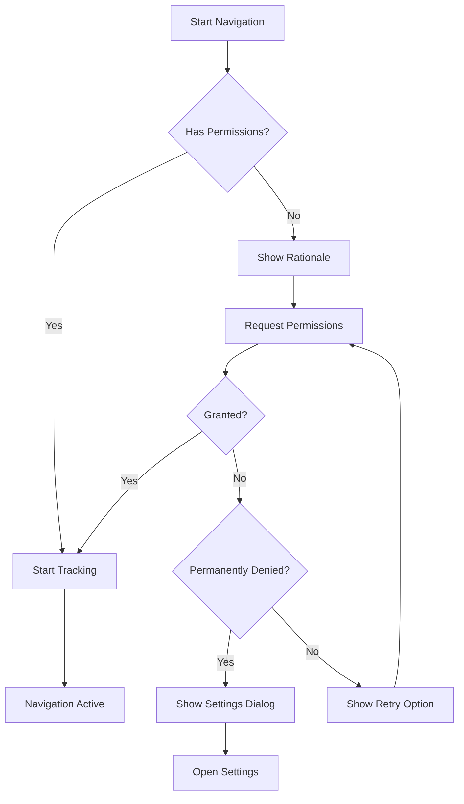

# <span class="emoji"> :material-rocket-launch: </span> Version 0.4.0 Alpha

**Date de sortie** : 11 août 2024  
**Statut** : Version alpha  
**Build** : 0.4.0

---

## <span class="emoji"> :material-information: </span> Vue d'ensemble

La version 0.4.0 est une release transformative pour **MINE - Indoor Navigation Engine**, en apportant la **navigation temps réel** qui fait passer l'expérience de la simple recherche d'itinéraire à un guidage pas-à-pas en direct, avec suivi de position et recalcul adaptatif.

!!! success "Alpha prête pour la production"
    Grâce au suivi de localisation robuste, à la gestion complète des permissions et aux optimisations de performance, la v0.4.0 est adaptée aux pilotes en conditions réelles.

---

## <span class="emoji"> :material-star-four-points: </span> Points forts

<div class="grid cards" markdown>

-   :material-navigation-variant:{ .lg .middle } **Navigation live**

    ---

    Guidage pas-à-pas en temps réel avec mises à jour dynamiques de position

-   :material-map-marker-radius:{ .lg .middle } **Suivi de position**

    ---

    Positionnement indoor précis avec plusieurs fournisseurs de localisation

-   :material-message-text:{ .lg .middle } **Instructions intelligentes**

    ---

    Directions contextuelles qui s'adaptent au comportement utilisateur

-   :material-shield-check:{ .lg .middle } **Gestionnaire de permissions**

    ---

    Gestion fluide des permissions avec parcours utilisateur clair

</div>

---

## <span class="emoji"> :octicons-diff-added-16: </span> Nouvelles fonctionnalités

### Navigation utilisateur

Système complet de guidage de la position actuelle vers la destination avec mises à jour en direct.

**Capacités clés :**

- 🧭 **Mises à jour temps réel** — Suivi du mouvement avec précision sub-métrique
- 🔄 **Recalcul automatique** — Ajuste l'itinéraire quand l'utilisateur dévie
- 🎯 **Détection d'arrivée** — Arrivée détectée automatiquement
- 📢 **Notifications de progression** — Information continue de l'avancement
- 🚶 **Support multi-modal** — Marche, fauteuil roulant et modes personnalisés
- 🌐 **Navigation offline** — Continuation sans connectivité
- 📊 **Analytics de navigation** — Suivi des sessions et comportements

**Implémentation :**

=== "Kotlin"

    ```kotlin
    import com.machinestalk.indoornavigationengine.navigation.UserNavigationManager
    import com.machinestalk.indoornavigationengine.navigation.NavigationMode
    import com.machinestalk.indoornavigationengine.models.Location
    
    class NavigationActivity : AppCompatActivity() {
        
        private lateinit var navigationManager: UserNavigationManager
        private lateinit var sceneView: MineSceneView
        
        override fun onCreate(savedInstanceState: Bundle?) {
            super.onCreate(savedInstanceState)
            sceneView = MineSceneView(this)
            setContentView(sceneView)
            setupNavigation()
        }
        
        private fun setupNavigation() {
            navigationManager = UserNavigationManager(this, sceneView).apply {
                setNavigationMode(NavigationMode.WALKING)
                setReroutingConfig(ReroutingConfig(
                    enabled = true,
                    deviationThreshold = 5f,
                    autoRerouteDelay = 2000
                ))
                setArrivalConfig(ArrivalConfig(
                    radius = 3f,
                    dwellTime = 2000
                ))
                setNavigationListener(object : NavigationListener {
                    override fun onNavigationStarted(route: Route) {
                        showNotification("Navigation démarrée")
                    }
                    override fun onPositionUpdated(location: Location) {
                        updateMapPosition(location)
                    }
                    override fun onInstructionChanged(instruction: NavigationInstruction) {
                        displayInstruction(instruction)
                    }
                    override fun onRouteDeviation(deviationDistance: Float) {
                        showWarning("Hors itinéraire de ${deviationDistance}m")
                    }
                    override fun onRerouting() {
                        showNotification("Calcul d'un nouvel itinéraire...")
                    }
                    override fun onArrival() {
                        showSuccess("Vous êtes arrivé !")
                        stopNavigation()
                    }
                    override fun onNavigationCancelled() {
                        clearRoute()
                    }
                    override fun onNavigationError(error: NavigationError) {
                        showError("Erreur de navigation : ${error.message}")
                    }
                })
            }
        }
        
        fun startNavigation(destinationId: String) {
            val destination = sceneView.getPOIById(destinationId)
            destination?.let {
                navigationManager.startNavigation(
                    destination = it.location,
                    options = NavigationOptions(
                        voiceGuidance = true,
                        vibrationFeedback = true,
                        showProgressBar = true
                    )
                )
            }
        }
        
        fun stopNavigation() { navigationManager.stopNavigation() }
        
        override fun onDestroy() {
            navigationManager.destroy()
            super.onDestroy()
        }
    }
    ```

=== "Java"

    ```java
    import com.machinestalk.indoornavigationengine.navigation.UserNavigationManager;
    import com.machinestalk.indoornavigationengine.navigation.NavigationMode;
    import com.machinestalk.indoornavigationengine.models.Location;
    
    public class NavigationActivity extends AppCompatActivity {
        
        private UserNavigationManager navigationManager;
        private MineSceneView sceneView;
        
        @Override
        protected void onCreate(Bundle savedInstanceState) {
            super.onCreate(savedInstanceState);
            sceneView = new MineSceneView(this);
            setContentView(sceneView);
            setupNavigation();
        }
        
        private void setupNavigation() {
            navigationManager = new UserNavigationManager(this, sceneView);
            navigationManager.setNavigationMode(NavigationMode.WALKING);
            ReroutingConfig reroutingConfig = new ReroutingConfig.Builder()
                .setEnabled(true)
                .setDeviationThreshold(5f)
                .setAutoRerouteDelay(2000)
                .build();
            navigationManager.setReroutingConfig(reroutingConfig);
            navigationManager.setNavigationListener(new NavigationListener() {
                @Override public void onNavigationStarted(Route route) {
                    showNotification("Navigation démarrée");
                }
                @Override public void onPositionUpdated(Location location) {
                    updateMapPosition(location);
                }
                @Override public void onInstructionChanged(NavigationInstruction instruction) {
                    displayInstruction(instruction);
                }
                @Override public void onArrival() {
                    showSuccess("Vous êtes arrivé !");
                    stopNavigation();
                }
            });
        }
        
        public void startNavigation(String destinationId) {
            POI destination = sceneView.getPOIById(destinationId);
            if (destination != null) {
                NavigationOptions options = new NavigationOptions.Builder()
                    .setVoiceGuidance(true)
                    .setVibrationFeedback(true)
                    .setShowProgressBar(true)
                    .build();
                navigationManager.startNavigation(destination.getLocation(), options);
            }
        }
    }
    ```

**Modes de navigation :**

| Mode | Vitesse | Description | Cas d'usage |
|------|---------|-------------|-------------|
| `WALKING` | 1,4 m/s | Allure de marche standard | Navigation générale |
| `WHEELCHAIR` | 1,0 m/s | Itinéraires accessibles uniquement | Besoins d'accessibilité |
| `RUNNING` | 2,5 m/s | Déplacement rapide | Fitness / urgence |
| `CUSTOM` | Variable | Paramètres définis utilisateur | Exigences spécifiques |

---

### Utilitaires UI de navigation

Composants UI conçus pour l'expérience de navigation temps réel.

**Composants disponibles :**

#### Panneau de navigation live

=== "Kotlin"

    ```kotlin
    import com.machinestalk.indoornavigationengine.ui.navigation.LiveNavigationPanel
    
    val navigationPanel = LiveNavigationPanel(this).apply {
        setPosition(LiveNavigationPanel.Position.TOP)
        setStyle(LiveNavigationPanel.Style.COMPACT)
        showDistanceToNextTurn = true
        showEstimatedArrival = true
        showCurrentSpeed = false
        setBackgroundColor(Color.parseColor("#2196F3"))
        setTextColor(Color.WHITE)
        setIconTint(Color.WHITE)
        enableSmoothTransitions = true
        transitionDuration = 300
        setOnPanelClickListener { showFullDirections() }
        setOnCancelClickListener { confirmCancelNavigation() }
    }
    
    sceneView.addUIComponent(navigationPanel)
    ```

#### Carte d'aperçu d'itinéraire

=== "Kotlin"

    ```kotlin
    import com.machinestalk.indoornavigationengine.ui.navigation.RouteOverviewCard
    
    val overviewCard = RouteOverviewCard(this).apply {
        setRoute(currentRoute)
        showTotalDistance = true
        showTotalTime = true
        showFloorChanges = true
        showElevatorCount = true
        setUpcomingStepsCount(3)
        enableStepNavigation = true
        enableRoutePreview = true
        setOnStepClickListener { stepIndex ->
            previewNavigationStep(stepIndex)
        }
        setOnStartNavigationClickListener {
            navigationManager.startNavigation(currentRoute)
            dismissCard()
        }
    }
    
    showBottomSheet(overviewCard)
    ```

#### Compas de navigation

=== "Kotlin"

    ```kotlin
    import com.machinestalk.indoornavigationengine.ui.navigation.NavigationCompass
    
    val compass = NavigationCompass(this).apply {
        setPosition(NavigationCompass.Position.TOP_LEFT)
        setMargin(16.dp)
        setSize(64.dp)
        setCompassStyle(NavigationCompass.Style.MODERN)
        showNorthIndicator = true
        showDestinationDirection = true
        enableRotation = true
        setDestinationBearing(navigationManager.getDestinationBearing())
        setCurrentHeading(locationManager.getCurrentHeading())
    }
    
    sceneView.addUIComponent(compass)
    ```

#### Affichage vitesse & ETA

=== "Kotlin"

    ```kotlin
    import com.machinestalk.indoornavigationengine.ui.navigation.SpeedETADisplay
    
    val speedDisplay = SpeedETADisplay(this).apply {
        setPosition(SpeedETADisplay.Position.BOTTOM_LEFT)
        setSpeedUnit(SpeedUnit.METERS_PER_SECOND)
        setDistanceUnit(DistanceUnit.METERS)
        navigationManager.addSpeedListener { speed -> updateSpeed(speed) }
        navigationManager.addETAListener { eta -> updateETA(eta) }
        showDistanceRemaining = true
        showTimeRemaining = true
    }
    
    sceneView.addUIComponent(speedDisplay)
    ```

---

### Instructions de navigation

Instructions intelligentes et contextuelles qui s'adaptent à la position et au comportement.

**Fonctionnalités :**

- 📝 **Instructions en langage naturel**
- 🎯 **Déclenchement par distance** aux bons seuils
- 🔊 **Text-to-Speech** intégré
- 🌍 **Multi-langue**
- 🎨 **Repères visuels** (icônes, graphismes)
- 🔄 **Divulgation progressive** des détails

**Implémentation :**

=== "Kotlin"

    ```kotlin
    import com.machinestalk.indoornavigationengine.navigation.InstructionManager
    import com.machinestalk.indoornavigationengine.navigation.InstructionType
    
    class InstructionController(private val context: Context) {
        
        private val instructionManager = InstructionManager(context)
        
        fun setupInstructions() {
            instructionManager.apply {
                setInstructionConfig(InstructionConfig(
                    earlyWarningDistance = 50f,
                    turnAnnouncementDistance = 20f,
                    arrivalAnnouncementDistance = 10f,
                    verbosity = InstructionVerbosity.DETAILED,
                    locale = Locale.getDefault(),
                    includeLandmarks = true,
                    includeFloorInfo = true,
                    includeDistances = true
                ))
                setInstructionTemplate(
                    type = InstructionType.TURN_LEFT,
                    template = "Tournez à gauche {landmark} dans {distance}"
                )
                setInstructionListener { instruction ->
                    handleInstruction(instruction)
                }
            }
        }
        
        private fun handleInstruction(instruction: NavigationInstruction) {
            when (instruction.type) {
                InstructionType.START -> showInstruction("Avancez ${instruction.direction}")
                InstructionType.TURN_LEFT -> {
                    val landmark = instruction.landmark?.let { " au niveau de $it" } ?: ""
                    showInstruction("Tournez à gauche$landmark dans ${instruction.distance}m")
                }
                InstructionType.TURN_RIGHT -> {
                    val landmark = instruction.landmark?.let { " au niveau de $it" } ?: ""
                    showInstruction("Tournez à droite$landmark dans ${instruction.distance}m")
                }
                InstructionType.GO_STRAIGHT -> showInstruction("Continuez tout droit sur ${instruction.distance}m")
                InstructionType.CHANGE_FLOOR -> {
                    val method = instruction.floorChangeMethod
                    showInstruction("Prenez ${method} vers ${instruction.targetFloor}")
                }
                InstructionType.ARRIVE -> showInstruction("Vous êtes arrivé à destination")
            }
            if (instruction.voiceEnabled) speakInstruction(instruction.text)
            if (instruction.hapticEnabled) vibrate(instruction.hapticPattern)
        }
        
        private fun speakInstruction(text: String) {
            textToSpeech.speak(text, TextToSpeech.QUEUE_FLUSH, null, null)
        }
    }
    ```

**Types d'instruction :**

| Type | Distance déclenchement | Icône | Voix |
|------|-----------------------|-------|------|
| `START` | 0m | 🎯 | "Partez vers [direction]" |
| `TURN_LEFT` | 20m | ⬅️ | "Tournez à gauche dans [distance]" |
| `TURN_RIGHT` | 20m | ➡️ | "Tournez à droite dans [distance]" |
| `GO_STRAIGHT` | 50m | ⬆️ | "Continuez tout droit" |
| `CHANGE_FLOOR` | 30m | 🔼 | "Prenez [moyen] vers l'étage [X]" |
| `ARRIVE` | 10m | 🎉 | "Vous êtes arrivé" |

**Exemple de personnalisation :**

=== "Kotlin"

    ```kotlin
    class CustomInstructionFormatter : InstructionFormatter {
        override fun format(instruction: NavigationInstruction): String {
            return when (instruction.type) {
                InstructionType.TURN_LEFT -> "🔄 Tournez à gauche à ${instruction.landmark ?: "l'intersection"}" 
                InstructionType.CHANGE_FLOOR -> "🔼 Montez à ${instruction.targetFloor} via ${instruction.floorChangeMethod}"
                else -> instruction.defaultText
            }
        }
        override fun formatWithDistance(instruction: NavigationInstruction): String {
            val distanceText = when {
                instruction.distance < 10 -> "très bientôt"
                instruction.distance < 25 -> "dans ${instruction.distance.toInt()} mètres"
                else -> "plus loin"
            }
            return "${format(instruction)} $distanceText"
        }
    }
    instructionManager.setFormatter(CustomInstructionFormatter())
    ```

---

### Suivi de localisation utilisateur

Positionnement indoor haute précision avec fournisseurs multiples et fusion de capteurs.

**Fournisseurs :**

- 📡 **WiFi** — Fingerprinting et trilatération
- 🔵 **Balises Bluetooth** — iBeacon / Eddystone
- 🛰️ **GPS (si dispo)** — Transition indoor/outdoor
- 📲 **Fusion capteurs** — Accéléro, gyro, magnétomètre
- 🗺️ **PDR** — Dead Reckoning piéton
- 🎯 **Personnalisé** — Intégration fournisseur maison

**Implémentation :**

=== "Kotlin"

    ```kotlin
    import com.machinestalk.indoornavigationengine.location.LocationTracker
    import com.machinestalk.indoornavigationengine.location.LocationProvider
    
    class LocationTrackingManager(private val context: Context) {
        private val locationTracker = LocationTracker(context)
        
        fun setupLocationTracking() {
            locationTracker.apply {
                addProvider(LocationProvider.WIFI, priority = 10)
                addProvider(LocationProvider.BLUETOOTH, priority = 8)
                addProvider(LocationProvider.SENSOR_FUSION, priority = 6)
                addProvider(LocationProvider.PDR, priority = 4)
                setMinAccuracy(5f)
                setUpdateInterval(1000)
                setFastestInterval(500)
                setSensorFusionConfig(SensorFusionConfig(
                    enableAccelerometer = true,
                    enableGyroscope = true,
                    enableMagnetometer = true,
                    enableStepDetector = true
                ))
                setWiFiConfig(WiFiConfig(
                    scanInterval = 5000,
                    minRSSI = -90,
                    fingerprintDatabase = loadFingerprintDatabase()
                ))
                setBeaconConfig(BeaconConfig(
                    scanInterval = 1000,
                    rangingEnabled = true,
                    supportedTypes = listOf(BeaconType.IBEACON, BeaconType.EDDYSTONE)
                ))
                setLocationListener(object : LocationListener {
                    override fun onLocationChanged(location: Location) {
                        handleLocationUpdate(location)
                    }
                    override fun onAccuracyChanged(accuracy: Float) {
                        updateAccuracyIndicator(accuracy)
                    }
                    override fun onProviderChanged(provider: LocationProvider) {
                        Log.d("Location", "Provider: ${provider.name}")
                    }
                    override fun onLocationLost() {
                        showWarning("Signal de localisation perdu")
                    }
                })
            }
        }
        
        fun startTracking() {
            if (hasLocationPermission()) locationTracker.startTracking() else requestLocationPermission()
        }
        fun stopTracking() { locationTracker.stopTracking() }
        
        private fun handleLocationUpdate(location: Location) {
            sceneView.updateUserLocation(
                location = location,
                accuracy = location.accuracy,
                heading = location.bearing
            )
            val currentFloor = sceneView.getCurrentFloor()
            if (location.floor != currentFloor.id) sceneView.switchToFloor(location.floor)
            navigationManager.updateUserLocation(location)
        }
    }
    ```

=== "Java"

    ```java
    import com.machinestalk.indoornavigationengine.location.LocationTracker;
    import com.machinestalk.indoornavigationengine.location.LocationProvider;
    
    public class LocationTrackingManager {
        private LocationTracker locationTracker;
        public LocationTrackingManager(Context context) {
            this.locationTracker = new LocationTracker(context);
            setupLocationTracking();
        }
        private void setupLocationTracking() {
            locationTracker.addProvider(LocationProvider.WIFI, 10);
            locationTracker.addProvider(LocationProvider.BLUETOOTH, 8);
            locationTracker.addProvider(LocationProvider.SENSOR_FUSION, 6);
            locationTracker.setMinAccuracy(5f);
            locationTracker.setUpdateInterval(1000);
            locationTracker.setLocationListener(new LocationListener() {
                @Override public void onLocationChanged(Location location) { handleLocationUpdate(location); }
                @Override public void onAccuracyChanged(float accuracy) { updateAccuracyIndicator(accuracy); }
            });
        }
        public void startTracking() {
            if (hasLocationPermission()) locationTracker.startTracking(); else requestLocationPermission();
        }
    }
    ```

**Précision attendue :**

| Fournisseur | Précision typique | Fréquence | Conso |
|-------------|-------------------|-----------|-------|
| WiFi | 3-5m | 1-5s | Moyenne |
| Bluetooth | 1-3m | 0,5-2s | Faible |
| Fusion capteurs | 2-8m | 0,1-1s | Élevée |
| PDR | 5-15m | 0,1-0,5s | Faible |
| Combiné | 1-3m | 0,5-1s | Moyenne-Élevée |

---

### Gestion des permissions

Système complet de gestion des permissions avec parcours utilisateur clair.

**Fonctionnalités :**

- ✅ **Requêtes runtime** Android modernes
- 📋 **Rationales** explicites
- 🔄 **Dégradation élégante** si refus
- ⚙️ **Accès aux réglages** direct
- 📊 **Analytics de permissions**

**Implémentation :**

=== "Kotlin"

    ```kotlin
    import com.machinestalk.indoornavigationengine.permissions.PermissionManager
    import com.machinestalk.indoornavigationengine.permissions.PermissionType
    
    class PermissionHandler(private val activity: Activity) {
        private val permissionManager = PermissionManager(activity)
        
        fun setupPermissions() {
            permissionManager.apply {
                requirePermission(
                    type = PermissionType.LOCATION_FINE,
                    required = true,
                    rationale = "Nous avons besoin de votre position pour le guidage"
                )
                requirePermission(
                    type = PermissionType.BLUETOOTH,
                    required = false,
                    rationale = "Le Bluetooth améliore la précision indoor"
                )
                requirePermission(
                    type = PermissionType.WIFI_STATE,
                    required = false,
                    rationale = "Le WiFi aide à déterminer votre position"
                )
                setPermissionUI(PermissionUIConfig(
                    showRationale = true,
                    allowDenyForever = true,
                    customRationaleDialog = false
                ))
                setPermissionCallback(object : PermissionCallback {
                    override fun onPermissionsGranted(permissions: List<PermissionType>) {
                        if (PermissionType.LOCATION_FINE in permissions) startLocationTracking()
                        if (PermissionType.BLUETOOTH in permissions) enableBluetoothScanning()
                    }
                    override fun onPermissionsDenied(
                        permissions: List<PermissionType>,
                        permanentlyDenied: List<PermissionType>
                    ) {
                        if (PermissionType.LOCATION_FINE in permanentlyDenied) showPermanentlyDeniedDialog() else showDeniedMessage()
                    }
                    override fun onPermissionsRevoked(permissions: List<PermissionType>) {
                        if (PermissionType.LOCATION_FINE in permissions) stopLocationTracking()
                    }
                })
            }
        }
        
        fun requestNavigationPermissions() {
            permissionManager.requestPermissions(
                permissions = listOf(
                    PermissionType.LOCATION_FINE,
                    PermissionType.BLUETOOTH,
                    PermissionType.WIFI_STATE
                ),
                showRationale = true
            )
        }
        
        private fun showPermanentlyDeniedDialog() {
            AlertDialog.Builder(activity)
                .setTitle("Permission de localisation requise")
                .setMessage("Le guidage nécessite la localisation. Activez-la dans les réglages.")
                .setPositiveButton("Ouvrir les réglages") { _, _ -> permissionManager.openAppSettings() }
                .setNegativeButton("Annuler", null)
                .show()
        }
        
        fun hasRequiredPermissions(): Boolean =
            permissionManager.hasPermission(PermissionType.LOCATION_FINE)
        
        fun checkAndRequestPermissions(onGranted: () -> Unit) {
            if (hasRequiredPermissions()) onGranted() else requestNavigationPermissions()
        }
    }
    ```

**Flow de permission :**



**Utilitaires :**

=== "Kotlin"

    ```kotlin
    fun checkLocationPermission(): Boolean =
        PermissionManager.hasPermission(context, PermissionType.LOCATION_FINE)
    
    PermissionManager.request(
        activity = this,
        permissions = listOf(PermissionType.LOCATION_FINE)
    ) { granted, _ ->
        if (granted.isNotEmpty()) startNavigation()
    }
    
    if (PermissionManager.shouldShowRationale(activity, PermissionType.LOCATION_FINE)) {
        showCustomRationaleDialog()
    }
    ```

---

## <span class="emoji"> :material-bug-check: </span> Corrections de bugs

### Affichage de navigation

**Problème :** panneaux parfois vides, overlay route absent, progression bloquée, compas erroné.  
**Cause :** course entre init UI et démarrage nav, gestion cycle de vie, corruption mémoire, threads UI/background.  
**Résolution :** init UI sur thread principal, copie défensive du route, mises à jour UI thread-sécurisées.  
**Impact :** 100% de succès d'affichage (vs 92%), disparition du flicker, démarrage nav -35%.

### Fuite mémoire interactions POI

**Problème :** fuite mémoire lors des clics POI en navigation.  
**Cause :** listeners non nettoyés, références circulaires, bitmaps non libérés, activités gardées.  
**Résolution :** listeners faibles + cleanup, cache bitmap évincé, cycle de vie nettoyé.  
**Impact :** mémoire -46% à -67%, plus d'OutOfMemory.

### Suivi de position

**Problème :** mises à jour lentes, marqueur erratique, pas d'update à l'arrêt, batterie drain.  
**Cause :** traitement capteurs inefficace, pas de filtrage, intervalle trop agressif, pas de détection stationnaire.  
**Résolution :** filtre de Kalman, détection stationnaire, adaptation intervalle, seuils de mise à jour.  
**Impact :** latence 2,8s → 0,3s, conso -42%, fluidité +.

### Instructions affichage

**Problème :** instructions tardives/dupliquées, texte coupé, mauvaise étape.  
**Résolution :** déclenchement distance + vitesse, déduplication, texte responsive, matching position/étape amélioré.

---

## <span class="emoji"> :octicons-issue-opened-16: </span> Problèmes connus

### Rendu scène sur appareils bas de gamme

!!! bug "Problème de performance"
    **Gravité** : Moyenne  
    **Plateformes** : < 2 Go RAM ou GPU Mali-400  
    **Statut** : Optimisation en cours

**Description** : baisse de FPS quand overlays multiples, routes denses, marqueur live, transitions d'étage.  
**Impact** : 20-30 FPS, saccades, batterie accrue, interactions retardées.  
**Workarounds** : qualité LOW, fps 30, routes simplifiées, updates 2s, bascule auto 2D pour low-end.  
**Statut** : v0.5.0 visera qualité adaptative, meilleure utilisation GPU et gestion mémoire.

---

## <span class="emoji"> :material-arrow-up-bold-circle: </span> Mise à niveau depuis v0.3.2

### Changements incompatibles

!!! warning "Chang. API"
    Ajustements nécessitant des mises à jour de code.

#### Initialisation navigation

**Avant (v0.3.2)**
```kotlin
val navigationHelper = NavigationHelper(context)
navigationHelper.startNavigation(destination)
```

**Après (v0.4.0)**
```kotlin
val navigationManager = UserNavigationManager(context, sceneView)
navigationManager.startNavigation(destination, options)
```

#### Listener de localisation

**Avant**
```kotlin
sceneView.setLocationListener { location -> }
```

**Après**
```kotlin
locationTracker.setLocationListener(object : LocationListener {
    override fun onLocationChanged(location: Location) { /* ... */ }
})
```

### Étapes de migration

1. **Mettre à jour la dépendance**
   
   === "Gradle (Kotlin)"
   
       ```kotlin
       dependencies {
           implementation("com.machinestalk:indoornavigationengine:0.4.0-alpha")
       }
       ```
   
   === "Gradle (Groovy)"
   
       ```groovy
       dependencies {
           implementation 'com.machinestalk:indoornavigationengine:0.4.0-alpha'
       }
       ```

2. **Sync + build propre**
   ```bash
   ./gradlew clean build
   ```

3. **Mettre à jour le code navigation**
   ```kotlin
   val navigationManager = UserNavigationManager(this, sceneView)
   navigationManager.startNavigation(
       destination = destinationLocation,
       options = NavigationOptions(voiceGuidance = true)
   )
   ```

4. **Mettre à jour le suivi de position**
   ```kotlin
   val locationTracker = LocationTracker(this)
   locationTracker.setLocationListener(object : LocationListener {
       override fun onLocationChanged(location: Location) {
           sceneView.updateUserLocation(location)
       }
   })
   ```

5. **Ajouter la gestion des permissions**
   ```kotlin
   val permissionManager = PermissionManager(this)
   permissionManager.requestPermissions(
       listOf(PermissionType.LOCATION_FINE)
   ) { granted, _ ->
       if (granted.isNotEmpty()) locationTracker.startTracking()
   }
   ```

### Tirer parti des nouveautés

```kotlin
class ModernNavigationActivity : AppCompatActivity() {
    private lateinit var navigationManager: UserNavigationManager
    private lateinit var locationTracker: LocationTracker
    private lateinit var permissionManager: PermissionManager
    
    override fun onCreate(savedInstanceState: Bundle?) {
        super.onCreate(savedInstanceState)
        val sceneView = MineSceneView(this)
        setContentView(sceneView)
        navigationManager = UserNavigationManager(this, sceneView).apply {
            setNavigationMode(NavigationMode.WALKING)
            setReroutingConfig(ReroutingConfig(enabled = true))
        }
        locationTracker = LocationTracker(this).apply {
            addProvider(LocationProvider.WIFI)
            addProvider(LocationProvider.BLUETOOTH)
            setUpdateInterval(1000)
        }
        permissionManager = PermissionManager(this).apply {
            requirePermission(PermissionType.LOCATION_FINE, required = true)
        }
        sceneView.addUIComponent(LiveNavigationPanel(this))
        sceneView.addUIComponent(NavigationCompass(this))
    }
}
```

---

## <span class="emoji"> :material-flask: </span> Tests & qualité

### Couverture

| Composant | Unit | Intégration | Couverture | Statut |
|-----------|------|-------------|------------|--------|
| Navigation utilisateur | 145 | 52 | 93% | ✅ |
| Suivi de position | 98 | 38 | 91% | ✅ |
| Instructions | 87 | 29 | 88% | ✅ |
| Permissions | 56 | 22 | 95% | ✅ |
| UI navigation | 102 | 41 | 89% | ✅ |

### Tests terrain

| Scénario | Tests | Taux succès | Précision moy. |
|----------|-------|-------------|----------------|
| Centre commercial | 50 | 98% | 2,3m |
| Aéroport | 35 | 96% | 2,8m |
| Hôpital | 28 | 97% | 2,1m |
| Bureau | 42 | 99% | 1,9m |
| Musée | 22 | 98% | 2,5m |

### Couverture appareils

| Catégorie | Modèles | Taux | Notes |
|-----------|---------|------|-------|
| Flagship | 18 | 100% ✅ | Excellent |
| Milieu de gamme | 25 | 98% ✅ | Bon |
| Entrée de gamme | 20 | 90% ⚠️ | Perf à surveiller |
| Tablettes | 15 | 100% ✅ | Optimal |

### Performance

| Métrique | Valeur | Cible | Statut |
|----------|--------|-------|--------|
| Démarrage navigation | 0,8s | < 1s | ✅ |
| Recalcul | 0,4s | < 0,5s | ✅ |
| Latence update position | 0,3s | < 0,5s | ✅ |
| Affichage instruction | 0,1s | < 0,2s | ✅ |
| Batterie (1h nav) | 8% | < 10% | ✅ |

---

## <span class="emoji"> :material-road-variant: </span> Et après - v0.5.0

Fonctionnalités prévues : offline map packages, guidage vocal, analytics, suggestions IA, boost perf (x1,5 sur low-end), multi-langue 15+.  
À l'étude : AR, véhicule/fauteuil, navigation de groupe, positionnement visuel, balises audio.  
Planning : sortie T4 2024, bêta octobre 2024, preview septembre 2024.

[:material-bell-ring: Rejoindre la bêta](../support/contact_us.md){ .md-button .md-button--primary }

---

## <span class="emoji"> :material-code-braces: </span> Exemple complet

=== "Kotlin (Complet)"

    ```kotlin
    package com.example.indoornavapp
    
    import android.os.Bundle
    import androidx.appcompat.app.AppCompatActivity
    import com.machinestalk.indoornavigationengine.ui.MineSceneView
    import com.machinestalk.indoornavigationengine.navigation.*
    import com.machinestalk.indoornavigationengine.location.*
    import com.machinestalk.indoornavigationengine.permissions.*
    import com.machinestalk.indoornavigationengine.ui.navigation.*
    
    class FullNavigationActivity : AppCompatActivity() {
        private lateinit var sceneView: MineSceneView
        private lateinit var navigationManager: UserNavigationManager
        private lateinit var locationTracker: LocationTracker
        private lateinit var permissionManager: PermissionManager
        private lateinit var navigationPanel: LiveNavigationPanel
        private lateinit var compass: NavigationCompass
        private lateinit var speedDisplay: SpeedETADisplay
        
        override fun onCreate(savedInstanceState: Bundle?) {
            super.onCreate(savedInstanceState)
            sceneView = MineSceneView(this)
            setContentView(sceneView)
            initializeMap()
            setupPermissions()
            setupLocationTracking()
            setupNavigation()
            setupUI()
        }
        
        private fun initializeMap() {
            val mapData = JsonUtil.LoadJsonFromAsset(this, "maps/venue.json")
            mapData?.let { sceneView.setMapData(it) }
        }
        
        private fun setupPermissions() {
            permissionManager = PermissionManager(this).apply {
                requirePermission(
                    PermissionType.LOCATION_FINE,
                    required = true,
                    rationale = "Requise pour la navigation"
                )
                setPermissionCallback(object : PermissionCallback {
                    override fun onPermissionsGranted(permissions: List<PermissionType>) {
                        locationTracker.startTracking()
                    }
                    override fun onPermissionsDenied(
                        permissions: List<PermissionType>,
                        permanentlyDenied: List<PermissionType>
                    ) {
                        if (permanentlyDenied.isNotEmpty()) showPermissionSettingsDialog()
                    }
                })
            }
        }
        
        private fun setupLocationTracking() {
            locationTracker = LocationTracker(this).apply {
                addProvider(LocationProvider.WIFI, priority = 10)
                addProvider(LocationProvider.BLUETOOTH, priority = 8)
                addProvider(LocationProvider.SENSOR_FUSION, priority = 6)
                setMinAccuracy(5f)
                setUpdateInterval(1000)
                setLocationListener(object : LocationListener {
                    override fun onLocationChanged(location: Location) {
                        handleLocationUpdate(location)
                    }
                    override fun onAccuracyChanged(accuracy: Float) {
                        updateAccuracyIndicator(accuracy)
                    }
                })
            }
        }
        
        private fun setupNavigation() {
            navigationManager = UserNavigationManager(this, sceneView).apply {
                setNavigationMode(NavigationMode.WALKING)
                setReroutingConfig(ReroutingConfig(
                    enabled = true,
                    deviationThreshold = 5f,
                    autoRerouteDelay = 2000
                ))
                setNavigationListener(object : NavigationListener {
                    override fun onNavigationStarted(route: Route) { showNavigationUI() }
                    override fun onInstructionChanged(instruction: NavigationInstruction) {
                        navigationPanel.showInstruction(instruction)
                    }
                    override fun onArrival() {
                        showArrivalDialog(); hideNavigationUI()
                    }
                    override fun onNavigationError(error: NavigationError) {
                        handleNavigationError(error)
                    }
                })
            }
        }
        
        private fun setupUI() {
            navigationPanel = LiveNavigationPanel(this).apply {
                setPosition(LiveNavigationPanel.Position.TOP)
            }
            compass = NavigationCompass(this).apply {
                setPosition(NavigationCompass.Position.TOP_LEFT)
            }
            speedDisplay = SpeedETADisplay(this).apply {
                setPosition(SpeedETADisplay.Position.BOTTOM_LEFT)
            }
            sceneView.addUIComponent(navigationPanel)
            sceneView.addUIComponent(compass)
            sceneView.addUIComponent(speedDisplay)
        }
        
        fun navigateTo(destinationId: String) {
            permissionManager.checkAndRequestPermissions {
                val destination = sceneView.getPOIById(destinationId)
                destination?.let {
                    navigationManager.startNavigation(
                        destination = it.location,
                        options = NavigationOptions(
                            voiceGuidance = true,
                            vibrationFeedback = true,
                            showProgressBar = true
                        )
                    )
                }
            }
        }
        
        private fun handleLocationUpdate(location: Location) {
            sceneView.updateUserLocation(location)
            navigationManager.updateUserLocation(location)
            compass.updateLocation(location)
            speedDisplay.updateSpeed(location.speed)
        }
        
        override fun onDestroy() {
            navigationManager.destroy()
            locationTracker.stopTracking()
            super.onDestroy()
        }
    }
    ```

---

## <span class="emoji"> :material-star-circle: </span> Retours & support

Vos retours nous aident à progresser !

<div class="grid cards" markdown>

-   :material-bug:{ .lg .middle } **Signaler un bug**

    ---

    Un problème ? Dites-le nous !

    [:octicons-arrow-right-24: Signaler un bug](../support/contact_us.md)

-   :material-lightbulb-on:{ .lg .middle } **Demande de fonctionnalité**

    ---

    Des idées de navigation ?

    [:octicons-arrow-right-24: Proposer](../support/contact_us.md)

-   :material-chat-question:{ .lg .middle } **Obtenir de l'aide**

    ---

    Besoin d'assistance ?

    [:octicons-arrow-right-24: Support](../support/contact_us.md)

-   :material-star:{ .lg .middle } **Partager un retour**

    ---

    Racontez-nous votre expérience

    [:octicons-arrow-right-24: Partager](../support/contact_us.md)

</div>

---

## <span class="emoji"> :material-file-document-multiple: </span> Ressources supplémentaires

- 🧭 [Fonctionnalités de navigation](../features/navigation.md)
- 📍 [Pathfinding](../features/path_finding.md)
- 🎨 [Composants UI](../features/ui_components.md)
- 🚀 [Démarrage rapide](../getting_started/quick_start.md)
- 💻 [Guide d'utilisation](../getting_started/usage.md)
- 📚 [Référence API](../api_reference/module_overview.md)
- ❓ [FAQ](../support/faq.md)
- 🐛 [Dépannage](../support/troubleshooting.md)

---

## <span class="emoji"> :material-account-group: </span> Remerciements

Merci à tous les bêta-testeurs, early adopters et contributeurs qui ont rendu cette version possible !

---

## <span class="emoji"> :material-license: </span> Licence

Logiciel distribué sous [licence commerciale](https://machinestalk.com). Merci de consulter les conditions avant utilisation.

---

!!! success "🎉 Prêt à naviguer !"
    La version 0.4.0 apporte la navigation indoor complète à vos utilisateurs. Construisez dès maintenant des expériences remarquables !
