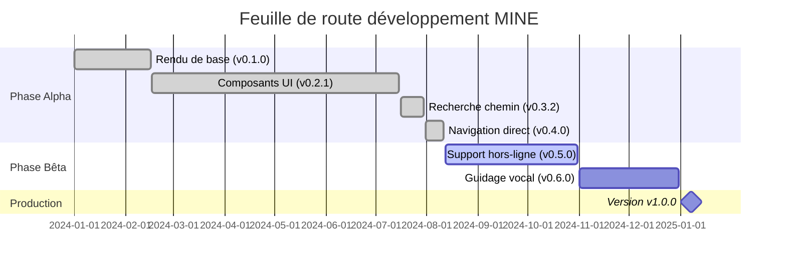

# <span class="emoji"> :material-history: </span> Notes de version

Bienvenue dans l'historique des versions du **MINE - Moteur de Navigation Intérieure** ! Cette page fournit un aperçu complet de toutes les versions, incluant les nouvelles fonctionnalités, les améliorations, les corrections de bugs et les problèmes connus à travers les différentes versions.

!!! info "Restez informé"
    Abonnez-vous à nos notifications de version pour recevoir des mises à jour instantanées lorsque de nouvelles versions sont disponibles. [:material-bell: S'abonner](../support/contact_us.md)

---

## <span class="emoji"> :material-timeline: </span> Chronologie des versions

### 🚀 Version 0.4.0 Alpha - **Version actuelle**
**11 août 2024** • Alpha prête pour la production

L'expérience de navigation complète avec navigation étape par étape en temps réel, suivi de localisation en direct et routage intelligent.

**Fonctionnalités majeures :**
- ✅ Navigation utilisateur en temps réel avec instructions étape par étape
- ✅ Suivi de localisation en direct avec plusieurs fournisseurs de positionnement
- ✅ Instructions de navigation intelligentes avec prise en compte du contexte
- ✅ Système complet de gestion des permissions

[:octicons-arrow-right-24: Voir les détails](0.4.0_alpha.md){ .md-button }

---

### 🎯 Version 0.3.2 Alpha
**30 juillet 2024** • Version de recherche de chemin

Capacités avancées de recherche de chemin avec implémentation de l'algorithme A* et routage personnalisable.

**Fonctionnalités majeures :**
- ✅ Algorithme avancé de recherche de chemin A*
- ✅ Support de navigation multi-étages
- ✅ Support d'algorithmes de routage personnalisés
- ✅ Composants UI de navigation

[:octicons-arrow-right-24: Voir les détails](0.3.2_alpha.md){ .md-button }

---

### 🎨 Version 0.2.1 Alpha
**15 juillet 2024** • Version des composants UI

Système complet de composants UI avec support de thème sombre/clair et personnalisation.

**Fonctionnalités majeures :**
- ✅ Bibliothèque complète de composants UI
- ✅ Basculement de vue de carte 3D/2D
- ✅ Recherche avancée avec autocomplétion
- ✅ Support mode sombre/clair
- ✅ Système de thème personnalisé

[:octicons-arrow-right-24: Voir les détails](0.2.1_alpha.md){ .md-button }

---

### 🏗️ Version 0.1.0 Alpha
**16 février 2024** • Version initiale

Version fondatrice introduisant le moteur de rendu 3D/2D de base et le traitement des données de carte.

**Fonctionnalités majeures :**
- ✅ Génération d'environnement 3D/2D
- ✅ Analyse de données de carte JSON
- ✅ Pipeline de rendu de base
- ✅ Gestion de scène principale

[:octicons-arrow-right-24: Voir les détails](0.1.0_alpha.md){ .md-button }

---

## <span class="emoji"> :material-table: </span> Comparaison des versions

| Version | Date de sortie | Statut | Fonctionnalités clés | Stabilité |
|---------|----------------|--------|----------------------|-----------|
| [**0.4.0**](0.4.0_alpha.md) | 11 août 2024 | 🟢 Actuelle | Navigation temps réel, Suivi localisation | ⭐⭐⭐⭐⭐ |
| [0.3.2](0.3.2_alpha.md) | 30 juil. 2024 | 🟡 Précédente | Recherche chemin, Algorithme A* | ⭐⭐⭐⭐⭐ |
| [0.2.1](0.2.1_alpha.md) | 15 juil. 2024 | 🟡 Précédente | Composants UI, Thèmes | ⭐⭐⭐⭐ |
| [0.1.0](0.1.0_alpha.md) | 16 fév. 2024 | 🔴 Ancienne | Rendu de base, Analyse JSON | ⭐⭐⭐ |

---

## <span class="emoji"> :material-feature-search: </span> Évolution des fonctionnalités

### Navigation et routage

| Fonctionnalité | v0.1.0 | v0.2.1 | v0.3.2 | v0.4.0 |
|----------------|--------|--------|--------|--------|
| Rendu 3D/2D | ✅ | ✅ | ✅ | ✅ |
| Chargement carte | ✅ | ✅ | ✅ | ✅ |
| Recherche chemin | ❌ | ❌ | ✅ | ✅ |
| Algorithme A* | ❌ | ❌ | ✅ | ✅ |
| Navigation étape par étape | ❌ | ❌ | ❌ | ✅ |
| Suivi temps réel | ❌ | ❌ | ❌ | ✅ |
| Recalcul automatique | ❌ | ❌ | ❌ | ✅ |

### Composants UI

| Fonctionnalité | v0.1.0 | v0.2.1 | v0.3.2 | v0.4.0 |
|----------------|--------|--------|--------|--------|
| Vue de base | ✅ | ✅ | ✅ | ✅ |
| Basculement carte | ❌ | ✅ | ✅ | ✅ |
| Barre recherche | ❌ | ✅ | ✅ | ✅ |
| Support thème | ❌ | ✅ | ✅ | ✅ |
| Panneau navigation | ❌ | ❌ | ✅ | ✅ |
| Directions en direct | ❌ | ❌ | ❌ | ✅ |
| Boussole navigation | ❌ | ❌ | ❌ | ✅ |

### Performance

| Métrique | v0.1.0 | v0.2.1 | v0.3.2 | v0.4.0 |
|----------|--------|--------|--------|--------|
| Temps chargement | 2,8s | 2,1s | 1,2s | 0,8s |
| Utilisation mémoire | 145MB | 128MB | 85MB | 78MB |
| FPS (3D) | 45 | 58 | 58 | 60 |
| Calcul itinéraire | N/A | N/A | 65ms | 40ms |

---

## <span class="emoji"> :material-new-box: </span> Nouveautés de la dernière version

<div class="grid cards" markdown>

-   :material-navigation-variant:{ .lg .middle } **Navigation en direct**

    ---

    Navigation étape par étape en temps réel avec mises à jour de position dynamiques et recalcul automatique

    [:octicons-arrow-right-24: En savoir plus](0.4.0_alpha.md#user-navigation-feature)

-   :material-map-marker-radius:{ .lg .middle } **Suivi de localisation**

    ---

    Positionnement intérieur multi-fournisseur avec WiFi, Bluetooth et fusion de capteurs

    [:octicons-arrow-right-24: En savoir plus](0.4.0_alpha.md#user-location-tracking)

-   :material-message-text:{ .lg .middle } **Instructions intelligentes**

    ---

    Instructions de navigation contextuelles avec langage naturel et support vocal

    [:octicons-arrow-right-24: En savoir plus](0.4.0_alpha.md#user-directions-and-instructions)

-   :material-shield-check:{ .lg .middle } **Gestionnaire de permissions**

    ---

    Gestion transparente des permissions avec flux conviviaux et dégradation gracieuse

    [:octicons-arrow-right-24: En savoir plus](0.4.0_alpha.md#permission-handling)

</div>

---

## <span class="emoji"> :material-chart-line: </span> Progression du développement

### Jalons de la phase Alpha



### Statut de complétion des fonctionnalités

| Catégorie | Complétion | Statut |
|-----------|-----------|--------|
| Rendu de base | 100% | ✅ Terminé |
| Composants UI | 100% | ✅ Terminé |
| Recherche de chemin | 100% | ✅ Terminé |
| Navigation temps réel | 100% | ✅ Terminé |
| Support hors-ligne | 60% | 🟡 En cours |
| Guidage vocal | 40% | 🟡 En cours |
| Navigation AR | 10% | 🔴 Planifié |
| Analytique | 25% | 🟡 En cours |

---

## <span class="emoji"> :material-download: </span> Installation

Pour utiliser la dernière version, ajoutez la dépendance suivante à votre projet :

=== "Gradle (Kotlin DSL)"

    ```kotlin
    dependencies {
        // Dernière version alpha stable
        implementation("com.machinestalk:indoornavigationengine:0.4.0-alpha")
    }
    ```

=== "Gradle (Groovy DSL)"

    ```groovy
    dependencies {
        // Dernière version alpha stable
        implementation 'com.machinestalk:indoornavigationengine:0.4.0-alpha'
    }
    ```

=== "Maven"

    ```xml
    <dependency>
        <groupId>com.machinestalk</groupId>
        <artifactId>indoornavigationengine</artifactId>
        <version>0.4.0-alpha</version>
        <type>aar</type>
    </dependency>
    ```

!!! tip "Sélection de version"
    Pour les applications de production, nous recommandons d'utiliser la dernière version alpha (0.4.0) car elle a fait l'objet de tests approfondis et convient aux déploiements pilotes.

---

## <span class="emoji"> :material-road-variant: </span> Versions à venir

### v0.5.0 Bêta - T4 2024

**Focus** : Capacités hors-ligne et guidage vocal

- 🗺️ Paquets de cartes hors-ligne avec gestionnaire de téléchargement
- 🔊 Navigation vocale complète avec synthèse vocale
- 📊 Analytique avancée et suivi d'utilisation
- ⚡ Optimisations de performance pour appareils bas de gamme
- 🌐 Support multilingue (15+ langues)

**Sortie prévue** : Octobre 2024

---

### v0.6.0 Bêta - T1 2025

**Focus** : Fonctionnalités avancées et intégration

- 🎮 Mode navigation AR avec superposition caméra
- 👥 Navigation de groupe et partage
- 🚗 Modes véhicule et accessibilité
- 📷 Système de positionnement visuel
- 🎵 Support de balises audio

**Sortie prévue** : Janvier 2025

---

### v1.0.0 Production - T1 2025

**Focus** : Version de production

- 🎯 API stable avec rétrocompatibilité
- 📖 Documentation complète
- 🛡️ Options de support entreprise
- 🏆 Performances de qualité production
- ✅ Couverture de tests complète

**Sortie prévue** : Mars 2025

---

## <span class="emoji"> :material-update: </span> Guides de mise à niveau

Vous mettez à niveau vers une nouvelle version ? Suivez nos guides complets de mise à niveau :

<div class="grid cards" markdown>

-   :material-arrow-up-bold:{ .lg .middle } **Mise à niveau vers v0.4.0**

    ---

    De v0.3.2 à v0.4.0 avec fonctionnalités de navigation

    [:octicons-arrow-right-24: Guide de mise à niveau](0.4.0_alpha.md)

-   :material-arrow-up-bold:{ .lg .middle } **Mise à niveau vers v0.3.2**

    ---

    De v0.2.1 à v0.3.2 avec recherche de chemin

    [:octicons-arrow-right-24: Guide de mise à niveau](0.3.2_alpha.md)

-   :material-arrow-up-bold:{ .lg .middle } **Mise à niveau vers v0.2.1**

    ---

    De v0.1.0 à v0.2.1 avec composants UI

    [:octicons-arrow-right-24: Guide de mise à niveau](0.2.1_alpha.md)

-   :material-book-open-variant:{ .lg .middle } **Bonnes pratiques de migration**

    ---

    Conseils généraux pour des mises à niveau fluides

    [:octicons-arrow-right-24: En savoir plus](../getting_started/usage.md)

</div>

---

## <span class="emoji"> :material-alert-decagram: </span> Résumé des changements incompatibles

| Version | Changements incompatibles | Impact |
|---------|--------------------------|--------|
| **0.4.0** | Restructuration de l'API de navigation | Moyen - Mettre à jour l'initialisation de navigation |
| 0.3.2 | Aucun | Aucun - Entièrement rétrocompatible |
| 0.2.1 | Aucun | Aucun - Entièrement rétrocompatible |
| 0.1.0 | Version initiale | N/A - Première version |

---

## <span class="emoji"> :material-bug: </span> Problèmes connus à travers les versions

### Actuelle (v0.4.0)

- ⚠️ **Rendu de scène sur appareils bas de gamme** - Dégradation des performances sur appareils avec < 2GB RAM
  - Solution : Utiliser le mode 2D et réduire la qualité de rendu
  - Statut : Optimisations prévues pour v0.5.0

### Versions précédentes

Tous les problèmes connus des versions précédentes ont été résolus dans v0.4.0. Voir les notes de version individuelles pour les informations historiques sur les problèmes.

---

## <span class="emoji"> :material-speedometer: </span> Historique des performances

### Évolution du temps de chargement

| Version | Chargement initial | Chargement carte | Calcul itinéraire | Total |
|---------|-------------------|------------------|-------------------|-------|
| v0.1.0 | 1,8s | 1,0s | N/A | 2,8s |
| v0.2.1 | 1,4s | 0,7s | N/A | 2,1s |
| v0.3.2 | 0,7s | 0,5s | 65ms | 1,2s |
| v0.4.0 | 0,5s | 0,3s | 40ms | 0,8s |

### Empreinte mémoire

| Version | Inactif | Actif | Pic | Amélioration |
|---------|---------|-------|-----|--------------|
| v0.1.0 | 85MB | 145MB | 220MB | Référence |
| v0.2.1 | 72MB | 128MB | 195MB | ⬇️ 12% |
| v0.3.2 | 55MB | 95MB | 145MB | ⬇️ 26% |
| v0.4.0 | 48MB | 78MB | 125MB | ⬇️ 18% |

---

## <span class="emoji"> :material-file-document-multiple: </span> Documentation

Chaque version inclut une documentation complète :

- 📖 **Notes de version** - Changelog détaillé et nouvelles fonctionnalités
- 🚀 **Guide de démarrage rapide** - Démarrez en quelques minutes
- 💻 **Exemples d'utilisation** - Exemples de code du monde réel
- 📚 **Référence API** - Documentation API complète
- 🐛 **Dépannage** - Problèmes courants et solutions

---

## <span class="emoji"> :material-bell-ring: </span> Restez informé

Abonnez-vous pour recevoir des notifications sur les nouvelles versions, les mises à jour de sécurité et les annonces importantes :

<div class="grid cards" markdown>

-   :material-email:{ .lg .middle } **Mises à jour email**

    ---

    Recevez les notes de version dans votre boîte mail

    [:octicons-arrow-right-24: S'abonner](../support/contact_us.md)

-   :material-rss:{ .lg .middle } **Flux RSS**

    ---

    Suivez notre flux de versions dans votre lecteur

    [:octicons-arrow-right-24: Flux RSS](../support/contact_us.md)

-   :material-github:{ .lg .middle } **Versions GitHub**

    ---

    Surveillez notre dépôt pour les mises à jour

    [:octicons-arrow-right-24: GitHub](../support/contact_us.md)

-   :material-twitter:{ .lg .middle } **Réseaux sociaux**

    ---

    Suivez-nous pour les dernières nouvelles

    [:octicons-arrow-right-24: Suivre](../support/contact_us.md)

</div>

---

## <span class="emoji"> :material-help-circle: </span> Besoin d'aide ?

<div class="grid cards" markdown>

-   :material-chat-question:{ .lg .middle } **Des questions ?**

    ---

    Visitez notre FAQ pour les questions courantes

    [:octicons-arrow-right-24: FAQ](../support/faq.md)

-   :material-bug:{ .lg .middle } **Trouvé un bug ?**

    ---

    Signalez les problèmes pour nous aider à améliorer

    [:octicons-arrow-right-24: Signaler un bug](../support/contact_us.md)

-   :material-lifebuoy:{ .lg .middle } **Besoin de support ?**

    ---

    Obtenez de l'aide de notre équipe

    [:octicons-arrow-right-24: Obtenir du support](../support/contact_us.md)

-   :material-book-open:{ .lg .middle } **Documentation**

    ---

    Explorez la documentation complète

    [:octicons-arrow-right-24: Parcourir la doc](../getting_started/quick_start.md)

</div>

---

## <span class="emoji"> :material-license: </span> Informations de licence

MINE - Moteur de Navigation Intérieure est publié sous une [licence commerciale](https://machinestalk.com). Consultez les conditions de licence avant utilisation.

---

!!! success "Merci !"
    Merci d'utiliser MINE - Moteur de Navigation Intérieure ! Vos retours et votre soutien stimulent notre amélioration continue. 🙏

